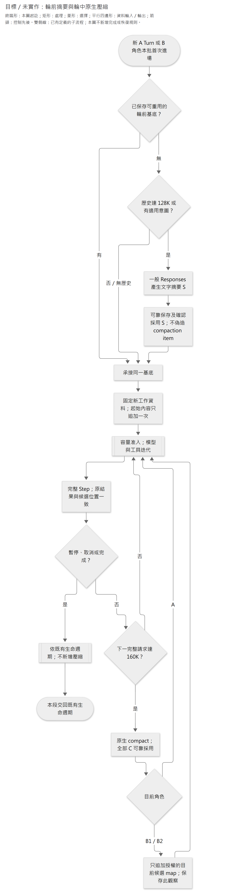

# 輪前摘要與輪中原生壓縮

**狀態：已確認的目標設計，尚未實作或驗收。** 輪前改用 App 管理的文字摘要；輪中保留 OpenAI standalone compaction。摘要 Prompt、保留內容、長度及品質判準仍待討論。本文只取代舊契約中相應的壓縮方式與 B1／B2 輪中導覽更新規則，不改來源資格、權限、Step、取消、交易或 Memory 發布流程。

現行程式仍在輪前與輪中使用原生 compaction，B1／B2 輪中壓縮後也尚未追加最新候選導覽。現行接線見[執行文件](../implementation/agent-execution.md)，本設計的狀態由[目前決策](../current-decisions.md)維護。

## 1. 為什麼區分輪前與輪中

輪前需要濃縮上一段工作，避免每輪 App 參考資料反覆累積；輪中則需要接續正在進行的模型與工具分析。兩者使用同一套保存與採用交界，但不必使用同一種壓縮方法。

[長訪談觀察](../experiments/product-validation/data/compaction-long-interview-2026-10-04/main-03/stopped-observation.md)發現，原生 compact 的返回視窗仍有歷次 App 資料訊息，其中重複承載導覽與訪談副本；完整請求在壓縮後仍接近中途門檻。這是該次實測，不是「OpenAI 永遠保留所有 user 訊息」的官方保證，也不能從加密項目推測其內部內容。

官方要求 standalone compact 的返回 `output` 整包作為下一個視窗，不可只挑加密項目或刪除其中保留的 App 訊息。因此，本設計不裁切原生結果，而是在合法輪前交界改用另外產生的文字摘要。這是針對累積問題的設計取捨；摘要是否能維持分析品質及降低完整請求用量，仍須對照驗證。

## 2. 工作範圍與觸發時點

**A 的一輪** 是處理一則新員工輸入的顧問 Turn，可包含多個 Step。**B1／B2 的一輪** 是各角色在同一 Memory 批次中的整段分析，不是一次模型請求。**本批** 是一次固定範圍的背景整理，由 B1 整理情境、B2 分析理解，再發布一版 Memory；完整定義見[本批與來源界線](2026-09-25-b1-b2-information-gap-lifecycle.md#本批與來源界線)。

| 時點 | 使用方式 | 不重做的事 |
|---|---|---|
| A 新 Turn 前 | 檢查 128K 門檻或已成立的 Agent 輪前壓縮意圖；需要時產生並採用文字摘要 | 不是每輪必摘要；不把新 App 資料與當次員工輸入先放進摘要 |
| B1 本批首次分析前 | 檢查自己的既有歷史，達 128K 才產生並採用文字摘要 | 不混入 B2 歷史或理解層；同批恢復不再準備一次 |
| B2 本批首次分析前 | 到 B2 實際開始時，檢查自己的既有歷史，達 128K 才產生並採用文字摘要 | 不提早為尚未開始的 B2 外送；不以 B1 私有 trace 作摘要 |
| 任一角色的輪中完整 Step 後 | 下次確實要呼叫模型，且完整待送請求達 160K 時，使用原生 standalone compact | 不重新執行輪前摘要、不在工具未配對或效果不明時壓縮 |
| 同 Turn／同階段中斷恢復 | 讀回原已保存的基底與後綴，沿原位置接續 | 不重送已保存摘要／compact、不重新追加原輸入或取新起始資料 |

首次沒有歷史，不產生空摘要；未達門檻且無適用意圖，完整沿用有效歷史。B1／B2 各自的輪前檢查只在本批首次進場做一次，採用摘要為零或一次；輪中保險是不同時點，不受此一次限制。

本次不改模型 Luna／high、128K／160K 門檻、既有呼叫／重試／時間限制或付費驗證授權。128K 檢查既有有效歷史，160K 檢查完整待送請求；兩者都不是模型容量上限。計量及容量准入仍依[共用執行](2026-09-27-shared-agent-execution-and-state-design.md#63-輪前主動壓縮與中途保險)。

## 3. 輪前：以文字摘要準備接續基底

App 以一般 Responses 請求產生摘要，不呼叫 `/responses/compact`，也不新增一個有業務工具或寫入權限的摘要 Agent。

1. 取得該職務檔案、該角色上一工作的**合法有效視窗 W** 。W 可以包含以前已採用的摘要及其後的原生接續，不等於重新載入資料庫全部歷史；不得包含已放棄的執行分支、當次新輸入或其他角色的私有內容。
2. 依門檻／適用意圖決定沿用 W 或請求摘要。摘要請求中的原生 items 保持其型別與配對，App 不解密 reasoning、不把它改寫成可讀文字。如何濃縮可讀資料及保留分析內容，依 §7 後續設計。
3. 摘要原回應可靠保存後，App 將核定的**摘要文字 S** 形成一則 `role: "user"` 的 App 資料訊息，作為新的接續基底。不得偽造 `type: "compaction"`、`encrypted_content` 或 provider reasoning item。
4. 確認 S 已採用，才固定新工作的資料並追加一次起始內容。舊 W 不再附回本次模型輸入；是否可清理仍依原保存與回看承諾。

以下只表示順序，不定義新的 JSON 欄位或摘要格式：

```text
A 新 Turn：
  既有有效歷史，或已採用的 App 接續摘要〔user〕
  → 本 Turn 的 App 資料〔user：固定 Memory 導覽、近期歷史訪談等〕
  → 本次員工原文〔user〕
  → 原生模型輸出與配對工具結果

B1 本批首次分析：
  B1 自己的有效歷史，或已採用的 App 接續摘要〔user〕
  → 本批 App 資料〔user：情境導覽、固定範圍訪談及必要說明〕
  → B1 原生模型輸出與配對工具結果

B2 本批首次分析：
  B2 自己的有效歷史，或已採用的 App 接續摘要〔user〕
  → 本批 App 資料〔user：情境／理解導覽、B1 變更資料及必要說明〕
  → B2 原生模型輸出與配對工具結果
```

固定角色指引、工具及安全規則仍由受控請求欄位提供，不以摘要替代。摘要是分析參考，不是新員工發言、正式 Memory、目前候選或已提交操作的證據；其中的舊標題、導覽及觀察也不能冒充新工作可見的目前資料。引用仍由原來源工具與 App 資格解析，不能引用摘要本身。

### Reasoning 與公開推理摘要的界線

自製接續摘要 S、API 的可讀 `reasoning.summary`、加密的 `reasoning.encrypted_content` 是三件不同的事。

- S 用於輪前濃縮可承接的分析資訊，不代表原加密推理狀態已被無損保留。
- 摘要請求自己的 reasoning 是該次摘要工作產生的狀態，不追加到 A／B1／B2 的主要分析歷史，也不冒充其上一輪推理。
- 採用 S 後，被摘要取代的舊 items 不再整包附回。`all_turns` 只能使用實際仍提供且相容的原生狀態，不能重建已不在請求內的舊 reasoning。
- 尚未採用 S 的歷史，以及 S 之後同輪產生的 reasoning、assistant `phase`、工具請求與結果，仍依原生契約完整承接。不能在普通工具往返中拿文字摘要替代尚未完成的推理與 call 配對。
- UI 公開處理訊息、可讀推理摘要與正式答覆的歷史回看不變；縮小活躍 Context 不等於刪除唯一回看來源。

資料角色及防注入邊界沿[App 資料訊息與原生項目](2026-09-26-consultant-context-and-state-design.md#31-app-資料訊息與原生項目的權限邊界)。S 同樣是低權限分析材料，不取得 system／developer 權限。

## 4. 輪中：原生壓縮後直接接續

只在完整 Step、全數工具結果已確定，且下一步仍需要模型時檢查中途保險。暫停、取消或完成先依原控制規則處理；不為不會發送的下一步增加壓縮請求。

App 提交該角色當前完整有效視窗，將**全部 `compacted.output`（C）按原型別與順序採用** 。不挑單一加密項目，不刪返回中的舊 App 訊息，也不在 C 後再附被它取代的 W。指令與允許工具仍按下一次 request 的欄位提供。

### A：不重加起始資料

```text
完整 C → 本 Turn 後續原生模型／工具內容
```

不再追加本次員工輸入、起始 App 資料或近期訪談，不換用背景剛發布的 Memory。A 全輪始終讀同一固定快照；需要其他資料時沿原按需工具取得真實觀察。這個組裝規則不依賴「provider 保證保留全部 user 訊息」的假設。

### B1／B2：只追加目前候選導覽

```text
B1：完整 C → 本批目前工作情境 map〔App user 資料〕→ 後續原生接續
B2：完整 C → 本批目前工作情境 map＋工作理解 map〔App user 資料〕→ 後續原生接續
```

輪中的候選會因自身工具操作改變，舊導覽只是先前觀察。因此 B1／B2 在每次輪中 compact 後，由 App 追加**當時同一候選工作區的目前導覽** ；清楚標示它是本批目前觀察。C 中保留的舊 map 不改寫、不刪除。

- B1 只有情境導覽，不得出現理解導覽或內容。
- B2 的情境是 B1 完成後交接的固定情境；理解導覽反映 B2 已成立的候選修改。B2 不回交 B1，無人在 B2 分析期間繼續修改本批情境。
- 不換成全域最新已發布 Memory，不改本批訪談上界或候選工作區。
- 只追加 map，不重送本批訪談、初始差異資料、正文、完整來源鏈或整份起始 App 資料。詳細資料仍按需讀取。
- C、導覽觀察及其對應候選位置須在依賴它們的推論前可靠保存、確認採用；中斷後承接原已保存導覽，不因重開再次取最新 map 或重複追加。這是既有接續保存的內容，不另立一套安全點或導覽資料庫。

追加導覽後仍須重新核對**完整待送請求** 的容量。若 compact 返回仍很大，不反覆壓同一未增長視窗、不裁切 C 或強送超量請求，沿原容量受阻規則處理。

## 5. 保存、取消與安全點不變

W → 新基底的可靠保存及採用仍沿[原採用交界](2026-09-27-shared-agent-execution-and-state-design.md#62-compact-的本機安全採用)；方法從原生 C 換為輪前 S，不改業務完成條件或 Step 恢復粒度。

| 可確認的位置 | 接續／回退要求 |
|---|---|
| S 已返回，尚未可靠保存 | W 仍可取回；不能開始依賴 S 的推論。W 超容量時也不能跳過必要準備強行外送 |
| S 已保存，採用是否成立不明 | 先查回原結果與採用位置，不重新生成一份摘要冒充原結果 |
| S 已採用，後面已有工作內容 | 同工作恢復 S 加原已保存後綴，不回到裸 S、不重加起始資料 |
| A 取消或最終放棄 | 回到當次輸入加入前的有效基底，保留已採用輪前 S；排除該輪輸入、候選、分析及輪中 C。重新提交原文仍是新 Turn |
| Memory 回到①或② | 候選與各角色 Context 一起回到該安全點的固定位置；保留在回退基底中已採用的輪前 S，不承接其後已放棄的分析或輪中 C |
| 已正式完成／發布 | 查回原正式結果，不因摘要、compact 或 Graph 確認遺失撤銷正式資料 |

沒有產生 S 時，表中的輪前基底就是原沿用的合法歷史。Memory 的①整理起點、②B1 完成交接、③正式發布，以及各 Step 的可恢復位置都不變；輪前摘要與準備結果沿現有機制保存，不新增第四個業務安全點。

輪中 C 不得覆寫仍需供整輪取消／階段回退的基底。舊 W 何時可清理由[保存規則](../architecture/persistence.md#6-保留失效與清理)決定，不因已取得摘要就刪除原話、正式快照、公開回看或原操作核對所需資料。摘要、compact 與模型 I/O 都不放入跨越整輪的 SQL 長交易。

### 目標流程圖

下圖是**已確認但尚未實作的 Context 流程** ；完成、候選提交與 Memory 三個安全點仍由各生命週期文件維護。



[圖源](../diagrams/specs/2026-10-04-context-summary-and-compaction-design/context-summary-compaction.mmd) · [SVG](../diagrams/specs/2026-10-04-context-summary-and-compaction-design/context-summary-compaction.svg)

普通故障恢復沿原已保存位置，不從圖首重新初始化。保存／容量失敗的處置依上表及共用有界恢復，不因圖只畫正常路徑而省略。

## 6. 與現行程式及其他文件的關係

| 現行接線 | 本設計要求的差異 | 不改的責任 |
|---|---|---|
| 輪前由 `RoleContextHistory` 取得原生 compaction 基底 | 輪前準備改能保存及採用 App 文字摘要；調整對 SDK `CompactedResponse` 的專用依賴 | 職務檔案／角色隔離、一次準備、保存先於採用、有效歷史位置 |
| 輪前與輪中共用原生 compact 能力 | 輪前摘要與輪中原生壓縮分開選擇，仍沿既有生命週期 | Step 控制、原結果核對、候選與正式結果的交易 |
| B1／B2 輪中 C 後沒有導覽追加 | 加入本批目前候選 map 的受控投影、保存與接續 | B1 不讀理解、B2 不寫情境、固定訪談上界及單向發布 |
| A 的 `request_context_compaction` 表示下輪準備意圖 | 目標語意是下一輪以新方式濃縮歷史；工具名稱及 wire 是否調整留待契約更新 | 本輪成功後意圖才成立；工具不直接觸發當步壓縮 |

「沿用原流程」指產品生命週期與安全保證不變，不表示完全不需調整程式型別、保存內容或請求組裝。本文不指定新資料表、通用摘要框架或第二份 Context 保存系統；正式接線在摘要契約定稿後再設計。

舊文件中「不以一般摘要取代原生狀態」仍適用於**輪中原生接續及現行程式** ，不再作為禁止此已確認輪前方案的依據。歷史實驗原件、Accepted ADR 及既有通過統計不改寫；新目標也不因文件完成而視為已部署。

## 7. 下一個討論與驗證範圍

下一個議題是**輪前摘要要保留什麼，怎樣避免反覆摘要後遺失重要分析** 。以下尚未定案，不由本次文件維護自行補成產品規則：

- A、B1、B2 各自須承接的分析結論、未解事項、精確條件／數值、更正、來源定位及舊觀察時效。
- 摘要 Prompt、輸入投影／重複資料處理、輸出格式與長度；是否保留未摘要的尾段及其合法邊界。
- 摘要請求的容量／輸出預留、品質不合格或歷史已超量時的有界處置。不能假定一般 Responses 能接收無限歷史。
- 上述輪前意圖工具的命名與說明如何同步新語意，不擅自變更既有 API schema。

完成摘要契約後，最低驗證應分開核對三方面：

1. **組裝與恢復：** 輪前未混入新輸入、S 不偽造原生 item、取消仍保留正確基底、採用不明先查原結果；同輪壓後 A 不重加資料，B 只加授權候選 map，恢復零重複追加。確認完整請求，而不只看摘要字數。
2. **分析品質：** 以相同資料及判準比較早期數值回提、跳題指涉、更正與補充、待釐清問題及來源支持；須包含多次輪前摘要及輪中原生壓縮，不只驗一次摘要能生成。
3. **用量與停止行為：** 同記實際 token、工具讀取、摘要／compact 次數、耗時及失敗；確認壓後仍超量不無限重壓。既有未完成四組比較不能冒充新設計的通過證據。

以上是後續驗證方向，尚無本方案的程式、真模型品質或用量改善結論；付費測試須另守當次界線，不因設計已確認就重跑已凍結實驗。

## 8. 官方依據與本案取捨

- [OpenAI standalone compaction](https://developers.openai.com/api/docs/guides/compaction#standalone-compact-endpoint)：輸入須符合模型容量，全部返回 output 是下一視窗；不能自行裁剪。支持本方案的**輪中** 接法，不規定 Caliburn 的摘要內容、門檻或回退安全點。
- [OpenAI 無狀態 reasoning](https://developers.openai.com/api/docs/guides/migrate-to-responses#4-decide-when-to-store-state)：`store: false` 下保留及重播返回的 reasoning items 才能利用相應加密狀態。文字摘要不是這項原生狀態的替代格式。
- [共用執行契約](2026-09-27-shared-agent-execution-and-state-design.md)與[資料保存](../architecture/persistence.md)：承接本產品既有的完整 Step、資格、候選、正式完成與原結果核對，不新增另一套恢復架構。

官方來源於 2026-10-04 核對。輪前自製摘要、輪中 B 導覽追加及其觸發方式是 Caliburn 的已確認取捨，不稱作廠商共同保證或已驗證的最優方案。
