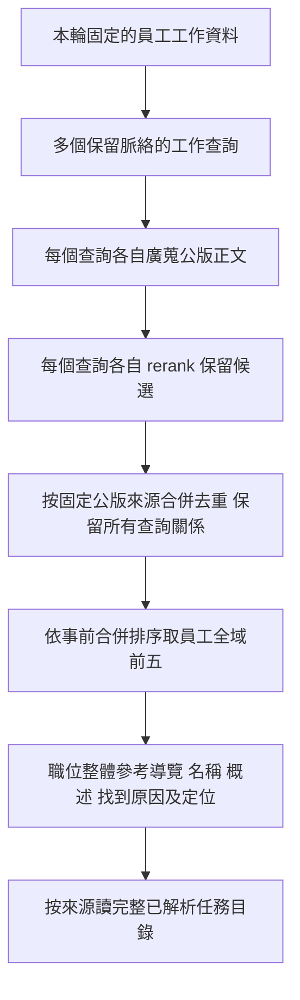

# 公版職位整體參考的搜尋定義

日期：2026-10-04。狀態：**研究候選，品質方案／參數尚未正式採納，未接 JD App**；2026-10-05 已授權的[獨立 API 契約與實作](2026-10-05-occupation-reference-api-design.md)另行記錄。[五案四組第一輪](../experiments/2026-10-04-representative-occupation-top5/run-01/README.md)已執行；整段 dense 暫留控制基線，廣蒐＋rerank 未呈現整體優勢，主要領域粒度及評審判讀仍有未解反例。[三類 A 訪談原文四法](../experiments/2026-10-04-a-interview-occupation-retrieval/run-01/README.md)接續完成：同人初期已找到的倉庫／採購強代表均保留，但更多原文、分段及 rerank 未穩定增加；額外責任降級與孤立動作給2待驗。

本輪先定義如何找職位整體參考。公版收尾用途保留為[用途參考](2026-10-04-public-reference-completion-design.md)，單項 JD 任務完整度機制暫緩；搜尋不輸出「員工已完成訪談」或「JD 已完整」。[較早的兩層檢索候選](2026-10-04-public-reference-retrieval-design.md)及封存實驗保留原貌，本文件細化職位整體參考的搜尋與交付邊界。

## 1. 職位整體參考的定義

2026-10-05 後續實作：使用者已授權[獨立公版參考 API](2026-10-05-occupation-reference-api-design.md)，
以原話 D20/T20 完整聯集至 rerank 作可執行控制初值，搜尋交完整已解析目錄，任務正文按需讀取。
本文件保存前期研究演進；API 實作不將候選參數升格為通用最佳，也未接 JD App／完成判斷。

**由員工目前已知的實際工作組合，找出可供顧問查閱整體任務目錄的相關公版候選集合。** 每份候選交代是哪幾段員工工作找到它，保留固定來源與可讀目錄。員工可以同時參考多個職位，職稱不必與公版相同。

「整體」指公版的完整已解析任務目錄可查，不表示該公版所有內容都適用員工，也不表示每份檢索候選必須逐項詢問。使用者最新要求先找能代表主要工作的職位，局部兼任不是本輪主要目標；只命中局部內容仍須在實驗結果列出，不能冒充強代表。候選搜尋集合、顧問實際採用的參考範圍、員工已確認的工作是不同內容。

當前比較員工主要工作領域是否有代表公版，不要求每個零星工作各留一份。主要責任不因低頻而被排除；次要局部工作的廣泛涵蓋保留在舊實驗。職位名稱供顯示與導覽，員工目前實際工作是查詢依據；不將最高分公版當成唯一職位，前端與後端可共同代表同一員工。

## 2. 輸入：固定工作資料與多個保留脈絡的查詢

目標 App 的候選輸入仍是一版已發布 **B2 工作理解正文**，必要時沿固定來源讀 B1 補分工、對象或條件。已依使用者要求以[五份固定合成員工需求](../experiments/2026-10-04-representative-occupation-top5/README.md)，在[第一輪](../experiments/2026-10-04-representative-occupation-top5/run-01/README.md)比較同一工作事實的整段／人工保留脈絡分段及有無 rerank；[原話與現行發布B1／B2六組比較](../experiments/2026-10-04-memory-layer-retrieval/run-01/README.md)也已完成八案。當輪B2逐理解列候選；[後續十二法](../experiments/2026-10-05-memory-public-unit-retrieval/run-01/README.md)不支持只採B2，原話整段對照仍需保留。雙輸入候選融合尚未測，未選定正式輸入。職稱、Memory 標題、工具清單不單獨作為工作查詢。

查詢須讓檢索模型讀到本人做什麼、對什麼、產出／用途，以及會影響相關性的條件與權責。B2 物件不等於一個 JD 任務；先比較完整物件正文與保留描述／範圍的分段，不先把 Markdown 每段、每句或所有案件各自當工作。第一個輸入元件的具體表示仍由實驗決定，本輪不為改寫查詢另增 LLM。

例如以下為**虛構查詢示意，非本輪實測結果**：

- 「依已確認需求與設計實作產品網頁、互動及資料顯示，串接後端提供的介面。」
- 「開發後端 API 與資料處理，維護資料庫存取；需求與對外承諾由產品負責人確認。」
- 「配合產品上線，處理部署失敗與服務異常；是否包含固定值班尚未確認。」

這些查詢共同代表員工工作組合，不先合成一句「全端工程師」再搜尋。查詢中的未知與別人責任不能被提升成本人已確認工作；保留脈絡仍不能保證 embedding 正確處理否定，須加入測試。

尚未整理的新訪談不因 Memory 未換版而消失。下一輸入實驗比較當次／近期有效原話的補查；正式來源資格、固定快照及更新承接沿[現行讀取契約](2026-09-27-memory-read-and-source-navigation-contract.md)與[更新研究](../research/retrieval/2026-10-04-public-reference-progress-and-context-selection.md)。尚無 Memory 時的原話路徑也要測，不假稱現有 App 已提供本搜尋。

## 3. 搜尋對象：公版工作正文

本輪沿已有文件層研究基線：公版概述及 **T／O／P 正文**。職位名稱、原始代碼、來源、版本與任務關係作 metadata；embedding 排除職位名稱、OPKS 代碼及表頭，保留項目正文／名稱。

每份公版的完整已解析任務目錄由來源結構讀取；任務細節及 K／S 可回查，不要求先建立額外向量。[公版切塊比較](../experiments/2026-10-04-public-chunk-retrieval/run-01/README.md)已固定八whole輸入，對比整份、任務及既有工作單元；T/U保留獨立概述chunk，按父公版合併。冷氣前五改善，混合前後端及倉庫卻丟失部分既有代表，整份保留控制基線，未選正式切法。[員工分段×切法交叉](../experiments/2026-10-04-query-chunk-cross-retrieval/run-01/README.md)已完成八案十法：倉庫找回既有代表、冷氣保留改善，全端仍缺後端且掉前端，整份仍作控制。[後續D/T/M及rerank十二法](../experiments/2026-10-05-memory-public-unit-retrieval/run-01/README.md)已比較整份＋task等權融合：原話task-R找回網站系統設計人的前後端共同參考，但先融合截20的M漏掉它；B2單獨也未進候選，R另有退步。混合方式／候選深度仍待驗；群組命中須彙整父公版，不能把任務相似視為職位整體已適用。

語料選版須保存可用主要版本及排除原因，歷史版本不重複堆進候選。官方來源宣告與本地推導分開，不把未知狀態當官方最新。此前 805 份凍結語料與排名不重選、不改寫；新的選版另定實驗輸入。

## 4. 候選流程：各工作廣蒐＋精搜，再合併來源

下圖是分段＋rerank 的候選流程；整段及無 rerank 控制組見[本輪比較草稿](../experiments/2026-10-04-representative-occupation-top5/README.md)。使用者已指定本輪每員工最終取排名最高的五份；合併排序規則及參數執行前另固定，不能用事後評審分數挑前五。

1. **各查詢廣蒐。** 取得相似工作正文的公版候選及原始排名／分數。
2. **各查詢精搜。** reranker 比較該工作查詢與候選正文，各自保留名次額度。
3. **合併來源。** 同一固定公版只列一次，保留它被哪些查詢找到；多段命中不是多份獨立公版證據。文件層基線只聲稱文件相關，沒有支持片段標註就不捏造任務命中。
4. **取最終前五。** 依事前固定的全域合併排序選最高五份去重來源；保存去留及全部命中邊，不是各查詢前五全部交付。
5. **提供整體導覽。** 名稱、概述、來源、找到它的員工工作及完整目錄入口先提供，正文按需讀取。
6. **查完整目錄。** 依已知公版身分／版本取回所有已解析任務，包含沒有被員工查詢直接命中的內容。分頁須明示範圍及完整取回方式。

舊 N20／每查詢 rerank K5 是文件層研究初值，與本輪的員工全域前五不同。本輪先以使用者指定的最終五份比較代表主要工作效果，候選深度、每查詢額度、合併方法及是否另設門檻仍未選定。不把 cosine／rerank 分數當職位符合率，也不直接沿用舊 K5 的品質結論。

當前以整段全文與保留脈絡分段作同時對照，不提前指定分段勝出。全文可能集中在一個主要領域，分段也可能讓局部工作或重複來源占滿前五；兩種都依[代表職位評分 v2](2026-10-04-representative-occupation-scoring-protocol.md)逐份判讀。

完整目錄讀取不再套相同工作向量篩選，讓顧問能查尚未談到的面向。官方機制方面，Qdrant 支援按來源欄位 grouping 及來源 lookup，lookup 是依身分連接而非另一個向量搜尋；這支持來源彙整與查閱分工，不能證明本案的語意品質。[Qdrant Search：Grouping／Lookup](https://qdrant.tech/documentation/search/search/)。查閱於 2026-10-04，不因此指定新 collection。

## 5. 交付內容與責任

以下為必要資訊，不是正式 HTTP／Tool schema：

| 內容 | 用途與限制 |
|---|---|
| 公版名稱與概述 | 讓顧問快速理解來源視角；不宣告員工職位。 |
| 固定來源、選用版本與內容定位 | App／索引服務綁定，可回到相同來源；不能查不到就換成新版。 |
| 哪些員工工作找到它 | 保留每個查詢及其本輪員工依據；檢查主次工作與混合職位是否被涵蓋。 |
| 各查詢排名與分數 | 保存搜尋證據；不自行跨查詢加總成職位機率，也不以命中次數決定適用性。 |
| 完整已解析任務目錄入口 | 按來源讀其他工作線索；解析完整不等於 PDF 抽取完全。 |

顧問可以看到「此公版因介面實作找到」「此公版因 API／資料處理找到」並按需查看各自目錄。單一採購或盤點動作找到另一職業公版時，找到原因仍只代表局部關聯，不自動擴大整體責任或形成必問清單。

搜尋服務保持無狀態，不保存員工 Memory、訪談或公版確認進度。員工依據及已確認／待處理結果仍屬呼叫端。搜尋更新、排名快取與確認進度沿用各有條件，不能因相同文字或同名把舊適用性結論直接套給新範圍。

零候選與服務故障分開；即使回傳前 K 也不表示有適用公版。公版沒有覆蓋的實際工作仍保留，不為取得參考而改寫或刪除它。

## 6. 現行能力、已有證據與下一個元件

[現有 indexer](../../apps/ocs-indexer/README.md)已有按公版讀任務的結構能力，但 profile embedding 含職稱、K／S 與活動樣本，搜尋為 hybrid RRF，與本文的正文／各查詢 rerank 基線不同。可評估重用來源讀取，不能直接把現有職類搜尋端點當本文已驗收實作。

[輸入邊界實驗](../experiments/2026-10-04-retrieval-input-boundaries/README.md)的 22 個已觀察合成情境，在相同 N20／K5 下：

| 表示 | 已標註支持主題保留 | 平均去重公版 |
|---|---:|---:|
| 多個原話段 | 86／86 | 12.55 |
| 整位員工原話合併全文 | 78／86 | 5.00 |
| 每句各查 | 86／86 | 23.68 |

全文合併漏了 8 個次要工作，逐句沒有增加已標註涵蓋但候選更多。這支持多個保留脈絡查詢的候選方向，不證明 B2 分段、任務層定位、否定判讀或公版整體適用性。[每段配額實驗](../experiments/2026-10-04-retrieval-passage-quota/README.md)也有次要工作被全域排序擠掉的反例。

**當前元件為固定需求與主要職位前五比較。** [第一輪](../experiments/2026-10-04-representative-occupation-top5/run-01/README.md)已固定 N20／全域 K5／RRF k2，完成五案四組與 49 唯一員工／公版盲評。整段 dense 暫留基線；rerank 把全端的前端公版從第 4 排至第 7，視覺設計公版從第 3 排至第 14。四組均未看到代表全端後端主要工作的 2／3 分來源，不能區分來源不足或漏搜；F04 領域粒度及跨對象 1／2 分界仍待驗。下一步先驗主要工作查詢表示及新評審反例，不把舊校準回歸當語意驗收；逐份分級仍不相加。前述 86／86 與平均 12.55 份是舊的支持保留／未設全域上限結果，不證明新的前五代表性。

[原話與發布B1／B2六組比較](../experiments/2026-10-04-memory-layer-retrieval/run-01/README.md)已固定八案及公版整份805篇，對照原話整段／保留脈絡分段、B1正文整合／逐情境、B2正文整合／逐理解；不另切句或補職稱。真Memory parent發布35情境與12理解，48組前五、93查詢及78唯一pair判讀保存。全端前端由原話整段第4至B2第1，採購逐理解將助理升第1；但帳務四個Memory第一名均文書助理0分，全端仍缺後端。六案B2僅一物件，無法證明逐理解切分效果；B2逐理解只作下一輪候選，原話整段保持控制，不宣稱最佳。資料表示遺漏不能縮小評審需求；少量Memory無來源細節、晚記完整source hash及計時範圍沿實驗限制，不升格產品驗收。

[接續十二法](../experiments/2026-10-05-memory-public-unit-retrieval/run-01/README.md)固定20個原話／B2查詢，D/T每query20父，M兩路等權RRF後取20，再比較完整D正文rerank。全端原話D排名40／T排名15的網站系統設計公版，T-R升第1且正文支持前後端；M聯集有它但融合第25被截，B2的D24／T41亦未進20。這支持先驗候選深度與截斷位置，不能由此保證混合或rerank最佳。B2僅前端／採購、視覺等加R會丟既有強代表，下一元件保留原話與B2平行控制；雙輸入融合及深度掃描尚未測。

[完整聯集保留至rerank重播](../experiments/2026-10-05-rerank-union-candidate-replay/run-01/README.md)已在同八案移除M的早截，固定D20/T20與K5、完整union池跨query RRF k2。20query聯集26–35父，共628固定品質pair，48舊R控制與551前輪seal不變；71唯一選中pair全部可重用原盲評、零新推論／外送。原話全端網站系統設計排第1，B2仍只有前端；其他案例無一致改善。配對量較原M-R 400增加57%，沒有fresh DB／GPU或端到端時間證據。先留聯集至R是避免早截的候選，未選通用最佳；候選深度、reranker適配、新holdout與品質／實際時間取捨接續驗證。

[初搜N20／40／80比較](../experiments/2026-10-05-initial-retrieval-depth/run-01/README.md)固定前輪158判讀中的12個主要代表及8個已知面向，H01課程行政尚無3、其面向未評，不使用0/0=100%。原話雙路N20即保留12/12與8/8，N40／80未增已知命中；B2 N20為11/12與7/8，N40由D24找回全端後端代表，N80無已知額外命中。排除多媒體／資材兩個語意疑義後結論一致，原分不改。O候選配對247/480/926、B2為381/748/1438，僅工作量不是fresh時間。冷氣B2 D28/T7已初搜進池，舊U-R排17，是重排／K5損失；不能一律說N20漏召回。原話D20/T20先保留基線、B2 D40/T40作後續候選，不能由pool retention宣稱全庫／真人涵蓋；候選參數通用性、R按主要工作代表性排序、最終K5及fresh時間接續驗證。

[B1整合／逐情境雙路廣蒐](../experiments/2026-10-05-b1-dual-route-retrieval/run-01/README.md)已依使用者同意補測同八案。O、B1-W、B1-S、B2-S共63query，沿805整份／8068任務點及本機1024向量，新算exact離線cosine並保留完整D/T聯集。B1兩法N20均11/12來源、7/8面向，N40均12/12、8/8；全端B1 D29/T48，F01單物件兩法正文相同。原話N20已保留全部已知，B1逐情境沒有比整合增加本清單涵蓋：N40配對2174對比485，但未測B1最終K5／rerank或fresh服務延遲。83舊路、48深度控制與1318舊seal核對不變；H01未評、非全庫Recall。原話D20/T20仍作控制；Memory若接續精搜，B1整合D40/T40可作較少配對的候選，未選正式輸入／參數。

加入同時有前後端責任的組合、主業之外的低頻工作、否定／別人負責、更正、Memory 改名／拆合及無合適公版的工作；新測試資料與已用回歸資料分開。初搜深度、每查詢額度、是否設門檻、文件／群組單位及 DB 方案接續比較，不同時調整所有因素。

後續決策模型篩選／直接交顧問及公版任務確認方式，待檢索可靠後再比較。最終五份是本輪比較額度，尚未定為正式 App 上限；本輪不指定新 Agent、正式 schema 或完整度算法。接續沿[逐元件計畫](../plans/2026-10-04-public-reference-retrieval-design.md)。
