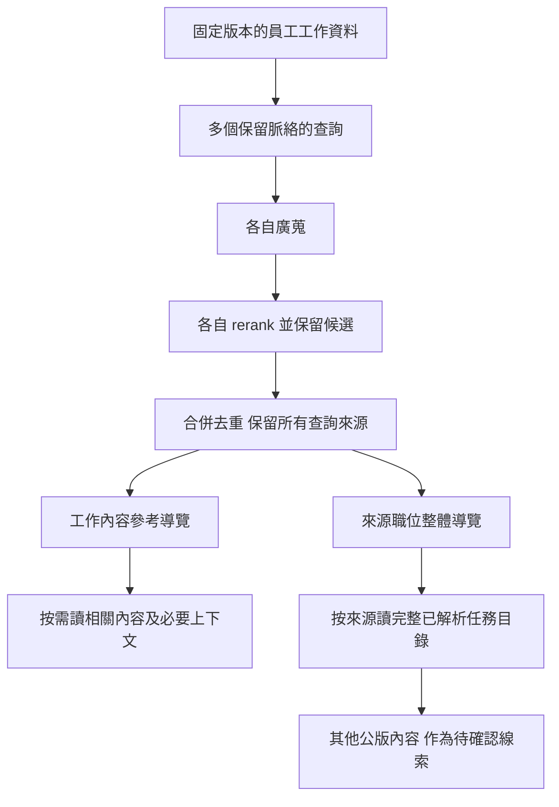

# 員工工作與公版參考檢索候選設計

日期：2026-10-04。狀態：**候選／隔離研究；尚未採納正式查詢契約、參數或接入 JD App**。由目前任務中的工程代理維護，產品取捨由使用者確認。範圍與入口見[目前決策](../current-decisions.md)；正式隔離責任沿 [ADR0079](../adr/0079-target-rebuild-production-cutover.md)及 [RAG 保留設計](2026-08-11-rag-bounded-context-retention-design.md)。

目的：用員工的實際工作找到公版參考，讓後續顧問可以深入相關內容，也可以回顧來源公版的其他工作面向。公版是參考，允許跨職位及任務多對多；不能直接把公版內容寫成員工事實。

## 1. 本輪界線與已知證據

使用者要求先處理向量資料庫及設計。**工作假設是暫不依賴顧問自行發現沒有線索的未知工作**；這不是已證實的模型失敗。分析方法是否能主動探索未知、顧問是否正確收尾，以及從空白訪談至正式 JD／PDF 的完整旅程，保留為後續必測項目。本輪沒有啟動先前討論的收尾判讀批次。

[輸入邊界實驗](../experiments/2026-10-04-retrieval-input-boundaries/README.md)在 22 個已觀察合成情境、805 份 T／O／P 正文上，固定每段初搜 20、rerank 留 5：原話段保留 86／86 已標註來源支持主題，合併全文為 78／86，逐句為 86／86。原話段平均 12.55 份去重公版、14,935 字元正文。這是支持文件存在於回傳集合的結果，沒有驗收相關任務片段、本人責任適用性、真實員工 Memory 或真正完整度。

目前 indexer 已有 profile／task 以及按公版讀任務的能力，見 [README](../../apps/ocs-indexer/README.md)。**現有 profile embedding 拼入職稱、K／S 及活動樣本；現有查詢使用 hybrid RRF，均不同於上述正文／exact dense 實驗。** 可研究重用其結構讀取，不能直接沿用其索引排名或假稱已通過新用途的檢索驗收。

## 2. 一份來源，兩種查閱視角

| 視角 | 要交付的資訊 | 用途與限制 |
|---|---|---|
| 工作內容參考 | 員工工作查詢、相關公版內容的定位、命中來源及搜尋證據 | 協助深入已知工作。目前實測只有文件層命中；任務／內容定位須另測，不能把整份候選公版的全部任務標成命中。 |
| 職位整體參考 | 來源公版的職位名稱、概述、完整已解析任務目錄，以及哪些員工工作找到它 | 提供可能尚未談到的工作面向。未命中任務保持「公版其他內容」，不是已確認適用或員工確實漏做。 |

兩種視角共用來源、版本及正文，不能把同一份公版算成兩份獨立證據。相同來源被多個工作查詢找到時，保留全部對應關係。同一公版的多個 T 名稱共用一組 O／P／K／S 時，保持原始共用關係，不把同一能力區塊重抄為多份独立證據。

職位整體參考先由工作搜尋的來源彙整，不固定員工職稱，也不把最高分職位視為本人職位。獨立整體職位搜尋是否能補上更多來源，列為後續比較候選，尚未採納。

## 3. 查詢輸入與員工資料責任

候選主要輸入是同一職務檔案的一版已發布 B2 工作理解正文；必要時沿該版固定引用回讀 B1 情境。Memory 所有權與發布不變，見[讀取契約](2026-09-27-memory-read-and-source-navigation-contract.md)。索引服務接收工作文字及由呼叫端管理的查詢對照，不保存員工訪談、Memory 或 JD 為公版資料。

下一輸入實驗比較原話段控制、B2 物件正文、B2 保留描述／範圍的分段，以及必要的 B1 情境對照。先使用現行流程曾生成的合成已發布快照；這不是新真實員工資料。Markdown 段落不是已驗收的工作單位，不新增一個 LLM 只為改寫查詢，也不先假定一個 Memory 物件就是一項 JD 任務。

查詢集合須涵蓋目前有效的主要、次要及低頻工作；保留對象、條件、更正、否定與權責的來源。純字串清理不保證模型理解否定。尚未被 Memory 整理的新訪談不因此被視為不存在；納入正式 consumer 的方式待接線設計，不能混入不同快照的正文與來源。

快取以查詢文字及 embedding 身分核對，搜尋結果另外綁定實驗／語料版本及參數。同字串可重用向量，不表示不同員工或不同版本的來源關係相同。

## 4. 公版資料與向量單位候選

公版原文、JSON 及結構來源由既有 PDF／JSON 管線提供。保留職位名稱、版本、來源 hash、原始代碼及任務關係作 metadata／讀取定位。**embedding 排除職位名稱、OPKS 代碼及表頭，保留項目正文／名稱。** 不按每個字母欄位分別建立向量。

| 候選單位 | embedding 文字 | 必須保留的關係 |
|---|---|---|
| 公版文件正文 | 沿用已測的概述與 T／O／P 正文 | 來源公版、版本及全部任務 |
| 有脈絡的公版任務群組 | T 名稱與共用 O／P，必要的公版／單元適用背景 | 原始 JSON 位置、共用區塊及父公版 |

兩條路需比較：文件廣蒐後在候選公版內找任務內容；或直接搜尋任務群組，再彙整父公版。前者可能漏掉整體文字不夠相似的局部工作；後者可能因任務太短而失去條件與權責。任務切塊、更小片段及加入 K／S 的效果均未驗收；K／S 可先作按需讀取內容，不能由既有 TOP 實驗推定加入後一定更好。

歴史版本不作主要候選堆疊。後續建立實验語料需記錄可用版本的選擇與排除原因，來源宣告及本地推導分開，未知狀態不得自動冒充官方最新。既有 805 份語料是凍結研究範圍，沒有因此獲得官方最新／完整逐字品質驗收。本輪結構原型只沿用該範圍，不重選版本或覆寫前輪結果。

缺漏或不支持的 JSON 結構須列出；「JSON 中全部已解析任務」不能稱作「PDF 所有內容」。按需查閱仍應可回到來源，避免讓抽取缺漏成為假完整度。

## 5. 搜尋及按需讀取流程

整張圖是候選，沒有接入正式顧問。N20／K5 是文件層對照初值，切換成任務群組後不能照搬其品質结論；參數須重新比較。初期不加絕對 cosine／sigmoid 門檻；分數不是責任符合率或完成率。

先各查詢保留額度，再合併；不默默套第二個全域 K 刪掉次要工作。若要降低來源數，需另測工作涵蓋，不只看總文件數下降。兩個導覽只帶必要名稱、短說明、來源關係與定位；正文按需讀。職位任務目錄可分次取得，但須明示範圍及完整取回方式，不能把第一頁當全部。

讀來源公版的其他任務是已知來源的結構查詢，不能再按同一工作向量過濾一次，否則未知線索又被排掉。顧問／後續模型判斷哪些值得詢問；檢索不自動生成「員工應承擔」或「JD 缺少」的結論。

Qdrant 官方提供 payload 分組、filter／scroll 及來源 lookup 能力，分組能將 chunk 彙整為文件，lookup 是身分 join 而非另一次相似度搜尋。這提供機制依據，不保證本案召回或新契約已實作。參考 [Search／Grouping](https://qdrant.tech/documentation/search/search/)與 [Filtering](https://qdrant.tech/documentation/search/filtering/)。既有 indexer 已可依公版代碼讀任務；先驗能否重用，沒有反例不新增第二套來源服務。

## 6. 查閱資料與異常界線

候選導覽至少保留：工作查詢對照、來源公版身分／版本、內容定位、文字來源 hash、vector／rerank 排名與分數。內部身分、版本及定位由程式生成，模型只選有效可讀目標。正式 HTTP／Tool schema 尚未建立；實驗輸出不能冒充 production 契約，後續沿[契約策略](../contract-strategy.md)維護唯一格式來源。

讀取必須返回定位所指的固定正文與必要父背景；不存在、版本不符或來源不可讀時明確報錯，不以最新版代替舊版。索引語料或模型身分不同須拒絕混用。搜尋確實零候選與服務故障分開呈現；均不能推出員工沒有這項工作。

同一工作有多個參考時保留多對多，內容相近但對象／條件／權責不同時不因關鍵字相同而合併。相關性未知不自動標不適用。額外決策模型在 rerank 之後的責任及直接交主 LLM 的比較，依原約定留待檢索與查閱驗證後進行；本輪不擅自刪掉或採納該模型。

## 7. 有界驗證順序

1. **來源及兩層導覽結構**：本輪用封存來源與 22 個原話段 rerank 結果做離線原型；核共同正文、所有查詢來源、完整已解析任務目錄及不可錯換版本。這不產生新排名。
2. **Memory 查詢表示**：先比較可回查的已發布 B2／B1 與原話控制，評已標註工作主題、次要工作及更正／權責的去留。舊情境作回歸，不冒稱新 holdout；另外需要新的多工作組合與未用於調整的案例。
3. **公版單位與內容减量**：比較文件先搜再定位、任務群組直接搜；先凍結來源支持片段標註，再檢查相關正文是否真的留下，不能只沿用文件 ID recall 作片段品質分數。
4. **資料庫方案與參數**：以 exact 作排名核對基準，依確定的輸入／資料單位比較候選深度、每段額度、必要的混合搜尋與 ANN；測整段耗時、正文／token 量及負載。現用 Qdrant 是研究基線，不宣告所有資料庫方案已比較完。
5. **後續 consumer 品質**：測顧問／決策模型按需讀取及未知線索是否有效，最後回到從空白訪談至可交付 JD／PDF。這些是待補驗項目，本輪不啟動、不以結構通過替代。

研究採納先要求每個有效已標註工作面向保有支持；來源標註不窮盡，不能把未知候選全算錯。除涵蓋外，記錄來源關係保真、未命中目錄可取回、正文量、實際 token、pair 量、DB／embedding／GPU／合併時間。參數、來源及預期判準在執行前固定，失敗與修訂另留原件。

本輪原型與核對見[兩層參考結構實驗](../experiments/2026-10-04-retrieval-reference-views/README.md)。接續實驗由[實驗索引](../experiments/README.md)查閱；後續比較依本節界定，不從已封存的施工清單推定完成。
