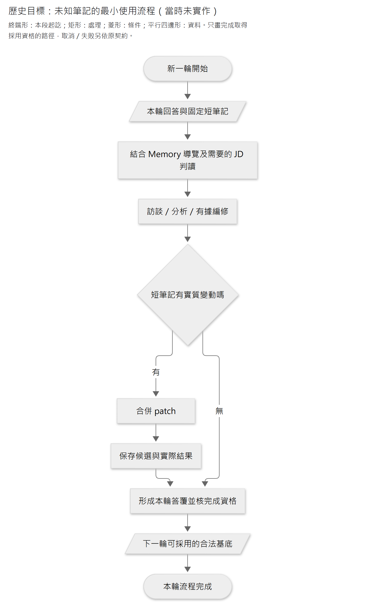
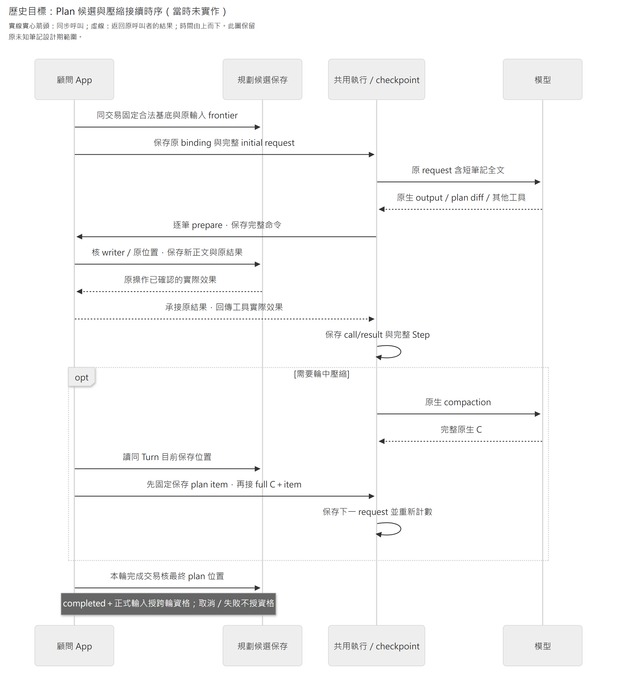

# 長訪談規劃與 JD 工作計畫

日期：2026-10-06；沿革整理：2026-10-08。議題 `INTPLAN`。**本頁保存原未知筆記設計、討論順序與實作／比較沿革；現行契約請讀 [JD 工作計畫](jd-work-plan.md)。**

[ADR0082](../adr/0082-consultant-jd-work-plan.md)已部分取代 ADR0081 的「只記未知、已解移除、大綱完全留在 Memory」。現行 Plan 保留主要方向、焦點與剩餘訪談／分析／JD 編修工作；舊方案不能與現行用法混用。§0–4、§7–9 與 §10.5 中的「本輪」「未實作」「待驗」「下一 gate」都指記錄當時，不表示現在仍待授權或施工。

原 §5–6 的有效工具、資格、交易、原能力及恢復細節，以及 §10–11 的現行內容，已移至現行頁，未保留第二份完整契約。原標題與錨點仍可導向接續章節；§6.3 圖保留原設計期時序。元件責任由[架構 §2.1](../architecture/system-boundaries.md#21-長任務的元件分工)維護，實測由原[施工證據](../plans/2026-10-07-interview-plan-implementation-and-comparison.md)及[新用途工程證據](../plans/evidence/jd-work-plan-2026-10-08.md)維護。

| 沿革範圍 | 內容與接續 |
|---|---|
| §0–4 | ADR0081 的問題收斂、原內容限定與使用候選；現行[內容](jd-work-plan.md#1-內容與格式)及[時機](jd-work-plan.md#2-使用時機與更新)另讀。 |
| §5–6 | 保留工具、保存與 UI 的舊錨點；有效契約移至現行頁 §4–7。 |
| §7–9 | 原驗收協議、G4 closure、工程及八案比較；不是 ADR0082 的效果證據。 |
| §10 | 現行用途已移出，保留公開依據、Q006 決策樹與較早表達範例。 |
| §11 | 工程變更與驗證的接續路由；實際結果查原 evidence，不在兩頁同步記每輪進度。 |

## 0 原筆記設計期紀錄與文件責任

本節是 ADR0081 原施工前的歷史 preflight；表內「本輪」指當時輪次。原工程與比較結果見 §9，目前接續討論見 §10。

依[已採用決策流程](../decision-process.md)及[架構討論方向](../architecture-discussion-standard.md)收斂。後者細節仍為討論稿，不另增加產品授權。

| 本輪 preflight | 內容 |
|---|---|
| Topic ID／stage | `INTPLAN`；G6 正式化／G7 施工與效果驗證中。原 G4 grilling 已收斂 Q001–005、空正文、跨 owner 資格、完成／換窗恢復及終局 UI；2026-10-07 使用者授權開始實作與真實比較。 |
| Binding decisions | 上述內容分工、同份唯讀 UI、V4A 重用；已有一般訪談、JD、Memory、執行與來源責任保持。 |
| 已答產品問題 | `INTPLAN-Q001`：焦點可含訪談、分析、JD 整理。`INTPLAN-Q002`：持久筆記須證明比單靠指引減少重要漏項／接續遺失；最終目標是高品質完整 JD，UI 只是附帶。`INTPLAN-Q003`：純公版／模型候選先中立詢問，有相關線索才列入筆記。`INTPLAN-Q004`（本輪 Q4）：可接受為重要理解增加必要有效追問，具體依分析／JD／顧問指南。`INTPLAN-Q005`（本輪 Q5）：以長任務為核心，驗收受訪者能產出高品質完整 JD；2026-10-07 使用者已確認。 |
| 本輪工程題 | §5.1 固定 nullable／空用途與共用純核心，§6.4 固定終局實際 GET 成功及呈現條件，§6.6 固定 typed 資格協調，§6.9 固定原能力、精確 C／projection 與完成恢復，§7.1 固定對照協議；沒有新增待答產品問題。 |
| 已有證據 | 研究 §1–18、使用者明確回答、現行 Memory patch／意圖摘要、公版候選／原操作、固定輸入與 completion／compaction、整檔刪除接縫，以及 PostgreSQL 官方約束／行鎖。公開補查含 ReCAP／ACM、ADaPT／Plan-and-Act、OpenAI 工具／compaction 與 Anthropic 筆記／harness；本輪工程查核含鎖定 TanStack Query 5.104.0、既有純核心與 native recovery／評測腳本。文件與核碼不等於資料庫或模型效果已驗。 |
| 本輪不處理 | 直接提交／merge／push／發布、既有資料處置、獨立 planner、多代理訪談、筆記檢索及一般任務引擎。 |

文件分工：`current-decisions.md` 只維護狀態與路由；本稿維護本題內容語意、工具、正常／異常接續及驗收；研究稿保存來源與沿革。一般訪談／JD 方法沿[分析與校準指南](../guides/README.md)，共通 patch／拒絕／原 request 沿原責任文件；本題只寫用途差異。G4 核查沿 §8 保存；後續施工與真模型原件由計畫連結，不重寫成另一份產品規格。

本題施工契約依下列範圍檢查，不重問已確認方向；設計已寫明的行為仍須在實作時驗證：

| 範圍 | G4 要交付的可檢查內容 | 目前狀態／段落 |
|---|---|---|
| 顧問使用 | 初期辨認、部分解答、轉題、新線索、更正、答不出，以及已有事實但 JD 未整理的接續。 | 已補候選使用例、可落入提示的文字及按需全文回看；§3–4。 |
| 工具與空正文 | diff／read 的正式 wire、實際效果、無變更／確定拒絕／保存未知；共用核心的用途空值規則與容量。 | wire、nullable no-op、空來源／空結果與純核心位置已固定；生成／provider 接受及容量初值仍待施工驗證；§5。 |
| 保存與採用 | 唯一保存責任、原位置、原操作結果、取消隔離、未建立／沿用／刻意空，以及完成交易採用資格。 | 兩表、FK／索引、base、typed owner 資格與 completion 原位置已固定；交易／故障反例待真 DB 驗證；§6.2、§6.5–6.7、§6.9。 |
| context 與 UI | 固定新輪基底、輪中工具結果、壓後精確投影；候選預覽與終局／重新載入的切換。 | 原能力分派、私有 graph shape／精確 C 及所有終局實際 GET 刷新已固定；DTO、恢復及瀏覽器接線待施工驗證；§6。 |
| 效果與驗證 | 行為反例、元件／真 DB／模型／真人的 pass-fail，成本與可有限驗證的 unknown。 | 指南、受控分支／自適應全場、私有 oracle、正式 JD 及 P1／P2 的對照分工已固定；實際施測資源另定，效果仍未驗；§7–7.1。 |

重開條件只限使用者改變效果、新官方事實或反例推翻假設、有效權責衝突；不因新名詞再開全套格式選型。G4 退出須讓未參與對話者能由本稿及引用判斷行為、責任與反例，且沒有待確認產品選擇；工程候選完成核對後才形成可施工設計。

## 1 效果與子任務的單位

工作方向是定位未釐清範圍的方式；子任務可以是尚未深入的一項工作，也可以是某項工作的局部重要缺口。例如盤點仍只有輪廓，就保留「釐清月末盤點的本人範圍與交付」；退貨的一般責任已清楚，只留下「主管不在時的例外交接」。不再把所有工作都建成永久子任務。

子任務是顧問可修訂的分析方向，供當下集中注意、之後返回未問完之處；可以隨訪談新增、拆小、合併、縮小或刪除。這些安排的成效最後須反映在 JD 的有據涵蓋、責任／判斷深度及一致性，不以筆記更詳盡、工具呼叫更多或顯示進度當成功。

| 要達成的效果 | 可觀察行為 |
|---|---|
| 保住整體重要缺口 | 深入目前題目時，其他未深入工作與低頻重要未知仍有去處；更新不丟未受影響事項。 |
| 保持當前注意力 | 用一句話交代目前聚焦的分析範圍，轉題後更新，不保存私有推理或注意力分數。 |
| 新線索可返回 | 新工作方向尚不清楚時先留線索；確認值得分析後成為子任務，補充既有工作則更新相關缺口。 |
| 已解就縮小 | 全部解決即移除；部分解決只保留剩餘未知。新證據可重新產生相關缺口，不永久鎖定 done。 |
| 不反覆逼答 | 答不出、拒答或待資料仍有重要未知時留短再訪條件；沒有新取證方式先轉向。 |
| 仍看全局 | 轉題／收尾時結合 Memory 的工作輪廓與 JD 查漏；規劃筆記空不自動等於所有工作已充分分析。 |

## 2 本案取捨與研究入口

採同一顧問的短可修訂筆記，目的是保住未完方向與全局回看，不先增獨立 planner。外部公開做法支持外化必要未完資訊，但不保證 TODO／筆記能改善本案 JD，也未共同指定唯一格式；效果按 §7 比較。

2026-10-07 使用者明確確認 `INTPLAN-Q002`：持久筆記必須相較只有指引的顧問證明 agent 增益。核心是聚焦、保留未問完的分析並接續到高品質完整 JD；受訪者看安排是附帶效果，不能單以可視性作導入理由。這是本案效果取捨，不是已證筆記有效。

第一手來源、版本／查閱日、官方保證與推論分界集中在[研究](../research/work-analysis/2026-10-06-long-interview-planning-and-focus-research.md)：§3–7 為訪談／長任務方法與選項，§9–10 保留內容形式演進，§11 為保存與 context，§12 為編輯比較及 Memory 重用。原研究前案不作 active 格式。

本輪具體實現補查沿[研究 §16](../research/work-analysis/2026-10-06-long-interview-planning-and-focus-research.md#16-2026-10-07-公開實現機制補查)。ReCAP 在子任務返回時帶回剩餘高階方向，ACM 示範短工作脈絡與原文按需回查；OpenAI 提供計畫工具與完整 compact output 契約，Anthropic 公開持久筆記及長任務 harness 經驗。這些支持比較「外化必要未完資訊、依觀察修訂、重新定焦時取用」，未共同指定本案格式或回看頻率，也未驗證員工訪談／JD。本文採 §4.2 的按需回看，不移植完整推理、遞迴樹或每個動作重規劃。

## 3 記錄與 Memory／上下文的分工

**本節保留 ADR0081 原重要未知筆記的歷史內容設計。** 下列「已知未入稿不放清單」已由 ADR0082 部分取代；現行工作計畫保留尚未完成的分析、JD 編修及核對工作，見 [§10](#10-jd-工作計畫內容與用法)。兩者不得混成同一套有效指引。

只保留有用的未完分析資訊：

| 內容 | 寫法與例子 |
|---|---|
| 目前焦點／注意事項 | 可為訪談、分析或 JD 整理，例如「先釐清異常退貨的判斷界線」、「整理已知盤點責任到 JD」；必要時一句話提醒返回方向或適用條件。 |
| 未釐清子任務 | 「盤點：本人範圍、差異確認與交付尚未清楚」；「退貨：主管不在時如何交接」。 |
| 待追線索 | 「提到緊急調貨，待判斷是否為另一項重要工作」。已屬某任務的線索可直接併入該缺口，不重抄兩處。 |

工作事實、工作大綱及已理解內容依 Memory／原話／有效上下文；JD 是待核對成品。筆記補目前工作及未釐清的導航，不保存完整問答、已完成清單或另一份工作摘要，也不能用來作 JD 事實引用。明確否認沿既有 excluded_work，不另重抄。

`INTPLAN-Q003` 已確認：尚無訪談／現有工作材料支持、純由公版或模型想到的方向，先中立詢問；取得相關線索後才寫入未釐清或待追線索。不能先把「年度預算」列成該員工已有的未完工作。沿 Memory 輪廓及公版的查漏仍可進行，不另建私有猜測筆記；線索進入規劃也不因此獲得 JD 事實資格。

沒有新事實不等於既有事實已整理完。缺口解掉可移除，顧問仍應沿已有依據與目前 JD 判斷必要編修；焦點可轉成該整理工作。未釐清清單不放「已知但尚未寫入」的一般待辦，不增 completed ledger。此分工沿[既有增量整理](../guides/2026-09-09-jd-field-and-writing-guide.md#增量整理調整分組也修正受影響的概述)，不另定 JD 的事實或保存權責。

解掉的缺口可移出目前筆記，依據仍可沿既有原話或已整理內容回查，不要求把結果再抄入規劃。背景 Memory 尚未發布時，新回答依近期原話與原生上下文使用，不等待發布才能修訂。模型要用已完成理解，沿原閱讀與來源契約取用；它若漏用，應驗證閱讀／接續效果，不先重建 completed ledger。

## 4 更新與全局回看

1. **新輪掃必要上下文**：結合目前筆記、Memory 導覽及近期回答，按需讀相關正文；焦點依目前訪談／分析／JD 整理需要維護，未釐清項有重要未知才保留或新增，不每輪重建全案。
2. **初期粗分未釐清工作**：已辨認但尚未了解的工作方向可先作粗子任務；已有內容足夠就沿用。當前重要範圍需要時才局部再拆。
3. **新回答判讀影響**：新工作／重要未知新增子任務；局部補充修改既有缺口；未定的新方向先留線索。確認不相關或已處理的線索移除。
4. **解掉就移除、部分解掉就縮小**：答案先核適用範圍；一般流程已清而例外仍未知，就只留下例外。移除目前筆記內容不等於刪除原話、Memory 或保存的原操作。
5. **答不出留條件**：仍重要時寫「取得新盤點案例後再核對差異責任」；條件未出現就不等義重問，出現後才判斷剩餘未知。若目前沒有合適再訪條件，可註明尚未釐清、目前不追問，不捏造取證承諾。本人拒答時沿本人主動重開或明確願意補充再談；未知、拒答與明確不負責分開。
6. **轉題／更正／收尾回看全局**：從 Memory 輪廓及有效回答辨認仍只有概述的重要工作、會改變責任／交付／要求的未知，以及已有依據尚未反映於 JD 的內容。必要才讀相關正文；一般局部追問不讀遍全案。新更正只重開相關未決問題，保住其餘有效理解與未完方向。
7. **目前焦點隨選擇更新**：可從訪談轉成分析／JD 整理；受訪者主動換題就衡量並調整，保留仍重要的未解事項，不讓筆記順序強制訪談。無當前焦點可以留空或不寫；沒有實質變化不呼叫工具，不固定多跑一個 planner。

子任務是未釐清事項，不要求永久 ID、三態進度或依賴 DAG，也不等於子 agent。先測同一顧問的簡短筆記與回看；只有具體反例顯示不足，再比較更多規劃角色。

### 4.1 候選正常使用與反例

下例為合成材料，展示安排怎麼縮小，不提供員工事實資格：

```markdown
## 目前焦點
釐清盤點差異的確認責任。

## 未釐清子任務
- 盤點：本人範圍、差異確認與交付。
- 退貨：主管不在時如何交接。
```

本人說清自己只負責清點並交差異表、確認責任仍未知時，盤點條目縮成「差異由誰確認」；退貨原樣保留。若稍後確認由主管判定，盤點缺口移除，已有理解沿原話／Memory；JD 尚未反映就將焦點轉成「整理盤點責任到 JD」。不能因筆記沒有盤點缺口而重問已知事實或忘記改稿。

| 事件 | 筆記及顧問的必要行為 |
|---|---|
| 一個回答同時解兩個局部問題、帶出新線索 | 同次判讀合併 patch；只移除已解，保住第三個未知；新線索先中立記錄，不升成工作事實。 |
| 正深談清點細節，但差異確認責任仍沒問完 | 焦點可繼續深入清點，未釐清仍保留差異確認；不因同題已有大量內容而移除整項盤點。 |
| 當前主題案例很多，另有僅提到的年度工作 | 重要轉題時回看輪廓，按需建立年度工作缺口；不重建所有工作的深入進度表。 |
| 想不起主管不在時的處理 | 留必要再訪條件並轉向；新案例出現才再評估，不重問正常流程。 |
| 本人改談教育訓練 | 更新焦點，仍重要的退貨未知保留；換題不等於已解或不負責。 |
| 更正先前責任、否認負責調度 | 局部重開受影響未知；已否認範圍沿既有排除資料，不留下反覆追問線索。 |
| 未釐清清單空了，但 JD 仍將協助清點寫成核准差異 | 依已有事實修 JD；仍回看工作輪廓，不用空筆記宣告完整。 |
| 初次沒有筆記、沒有未知，但 JD 仍有上述責任錯誤 | 可直接建立「修正盤點責任到 JD」焦點，省略未釐清小節；不為建立筆記捏造缺口。 |
| 公版提到年度預算、員工尚未提及 | 先中立詢問是否相關；相關時才記剩餘未知，不相關則沿既有排除責任，不先公開列為已存在的子任務。 |

原設計期的目標最小使用流程（當時未實作）：



[圖源](../diagrams/specs/2026-10-06-consultant-interview-planning-and-focus-design/historical-note-flow.mmd) · [SVG](../diagrams/specs/2026-10-06-consultant-interview-planning-and-focus-design/historical-note-flow.svg)

流程不要求每輪都有 patch，也不要求問答、讀取及 JD 編修固定順序；實際因果依需要與已有上下文。成功結果足夠就不為確認重讀全文，必要回查才 read。

### 4.2 顧問提示與全文回看的具體用法

**候選／未實作**：在既有顧問方法中加入下面的使用指引，工具描述只交代用途及輸入／回傳，不另設規劃角色。筆記是分析安排資料，不覆寫顧問方法、取證或工具契約；判斷依原話、Memory、JD 及有效上下文。

```text
你的最終目標是有依據、完整且高品質的 JD。先理解工作輪廓，再集中深入當前重要範圍。
使用目前規劃筆記維持焦點與未完方向；大綱、已理解事實及已完成內容沿 Memory／原話／上下文取用。
只保留目前焦點、重要未釐清子任務及必要線索；焦點也可以是分析或整理已有事實到 JD。
部分回答只縮小已解部分，保留同題其他未知及其他主題；解決即移除，更正只重開受影響部分。
新線索可新增、拆小或合併；純公版／模型想到的工作先中立詢問，有相關線索才記。
答不出不代表已解；留必要再訪條件，取得新線索再評估，沒有新線索不反覆追問。
本人拒答不代表已解；只有本人主動重開或明確願意補充時再談。
焦點收束、轉題、重大更正或收尾時，回看目前完整筆記與必要的工作輪廓／JD，再選下一步。
若無法準確掌握目前筆記，用 read_interview_plan 取得全文；已有足夠脈絡時不用為確認再讀。
有實質變動才用 edit_interview_plan 的 V4A diff，合併相關修改；依成功回傳的實際效果接續。
筆記為空仍需回看輪廓、必要原話及 JD 查漏，不能以清空或工具成功宣告分析完整。
```

這段是 Caliburn 的候選行為指引，不是廠商官方 prompt，也不保證模型會遵守。回看指**重新核對現在剩餘的完整範圍**，不等於每次必須呼叫 read：本輪全文及實際修改仍清楚時可直接使用；長段深入後無法掌握目前全文、工具觀察不足以確認內容或 patch 定位遭拒時，才回查目前正文。不得以近期只看到的一個局部 diff 當成全部未知，也不必在成功 edit 後立刻重讀。

| 觸發情境 | 記錄／取用行為 |
|---|---|
| 首次辨認工作輪廓 | 已辨認但未深入的重要工作可粗分未釐清子任務；沒有未知時也可建立必要分析／JD 整理焦點。不預寫無線索的全部問題。 |
| 同題深入、部分解答或一答多題 | 核回答適用範圍，合併有關變動為 patch；保住其他仍重要未知。沒有語意變化不寫。 |
| 新方向、轉題、重大更正 | 回看完整目前筆記再選焦點；新增或局部修訂，保留未受影響事項。受訪者換題不強制按清單順序。 |
| 答不出、拒答、等待新資料 | 重要未知保留短條件；答不出取得新線索再評估，拒答沿本人主動重開／明確願意補充。未有條件先轉向，不為維護筆記反覆提問。 |
| 焦點收束或準備收尾 | 回看剩餘方向及必要輪廓／JD；檢查尚未發現的重要工作與已有理解未正確入稿，空筆記不是完成證明。 |
| 新 Turn 或 native compact 後 | 使用 App 投影的短筆記全文；壓後是補回已保存資料，不要求額外重規劃或重寫。投影／恢復沿 §6。 |

尤其要測「長段深入、尚未 compact」的注意力反例：資料還在 input，但較早剩餘方向可能被忽略。若這個情境失敗，先判斷筆記內容、顧問回看或原話取用哪一項失效；不能從單一失敗直接增每 Step 全文 hook。ReCAP 未隔離重新注入的獨立增益，ACM 的收益亦伴更多探索與工具使用；本候選頻率仍由 §7 驗證。

## 5 最小工具內容與 UI

現行契約已移至 [5 最小工具內容與 UI](jd-work-plan.md#4-工具與編輯)；本節保留原錨點供既有引用接續。

原設計曾比較 `old_text/new_text` 字串替換，後依使用者指定撤回，重用 Memory 的 V4A 正文編輯。此沿革不改變現行編輯契約。

### 5.1 重用 Memory patch 的範圍與空正文

現行契約已移至 [5.1 重用 Memory patch 的範圍與空正文](jd-work-plan.md#41-共用正文編輯與空值)；本節保留原錨點供既有引用接續。

### 5.2 待審最小 wire 與工程容量

現行契約已移至 [5.2 待審最小 wire 與工程容量](jd-work-plan.md#42-wire-與工程容量)；本節保留原錨點供既有引用接續。

## 6 保存與模型接續：沿現有責任補接縫

現行契約已移至 [6 保存與模型接續：沿現有責任補接縫](jd-work-plan.md#5-保存與模型接續)；本節保留原錨點供既有引用接續。

### 6.1 文字保存與進入 context

現行契約已移至 [6.1 文字保存與進入 context](jd-work-plan.md#51-文字保存與進入-context)；本節保留原錨點供既有引用接續。

### 6.2 固定位置、保存資格與恢復

現行契約已移至 [6.2 固定位置、保存資格與恢復](jd-work-plan.md#52-固定位置保存資格與恢復)；本節保留原錨點供既有引用接續。

### 6.3 目標接續時序

下圖保留原設計期的目標時序（當時未實作），描繪責任交界，不新增執行狀態；後續實作結果見 §9。實線實心箭頭表示呼叫，虛線表示回到原呼叫方的結果。



[圖源](../diagrams/specs/2026-10-06-consultant-interview-planning-and-focus-design/historical-plan-sequence.mmd) · [SVG](../diagrams/specs/2026-10-06-consultant-interview-planning-and-focus-design/historical-plan-sequence.svg)

### 6.4 同份 UI 的讀取優先規則

現行契約已移至 [6.4 同份 UI 的讀取優先規則](jd-work-plan.md#6-同份唯讀-ui)；本節保留原錨點供既有引用接續。

### 6.5 資料庫表示：完整正文、候選指標與原結果

現行契約已移至 [6.5 資料庫表示：完整正文、候選指標與原結果](jd-work-plan.md#53-資料庫表示完整正文候選指標與原結果)；本節保留原錨點供既有引用接續。

### 6.6 讀取與交易：由已保存位置決定正文

現行契約已移至 [6.6 讀取與交易：由已保存位置決定正文](jd-work-plan.md#54-讀取交易與跨輪採用資格)；本節保留原錨點供既有引用接續。

### 6.7 保留及可證偽的資料庫反例

現行契約已移至 [6.7 保留及可證偽的資料庫反例](jd-work-plan.md#56-保留與故障反例)；本節保留原錨點供既有引用接續。

### 6.8 最小接線與模組責任

當時施工順序由純正文用途政策、Plan owner 與真 DB 反例開始，再接固定捕捉、工具及完成，接著驗壓後投影與終局 UI，最後比較 P1／P2。方法提示與工具保存分開測；這是原施工分工，不是新的實作授權。

現行契約已移至 [6.8 最小接線與模組責任](jd-work-plan.md#7-接線與模組責任)；本節保留原錨點供既有引用接續。

### 6.9 Captured 能力與換窗投影的施工契約

現行契約已移至 [6.9 Captured 能力與換窗投影的施工契約](jd-work-plan.md#55-captured-能力換窗投影與完成恢復)；本節保留原錨點供既有引用接續。

## 7 效果比較與驗收

**最終驗收是 JD 的品質、完整性及依據一致；直接機制效果是顧問能聚焦並接續未完分析。** 主要變因是焦點、重要未釐清與線索能否在同題深入、主題切換、多輪／換窗後正確接續。固定模型、初始 Memory／JD、可用來源與資源條件；受控分支固定可見原話 prefix，完整自適應訪談固定私有事實及披露政策，不能強迫不同問題得到相同回答順序。各組受測 prompt 預先凍結並保留版本，並非三組文字完全相同：

| 組別 | 比較目的 |
|---|---|
| P0 現有顧問 | 先定位目前跨工作漏項、缺口遺失或不必要重問的反例。 |
| P1 焦點／缺口與全局回看指引 | 同能力補有缺才記、已解移除、線索修訂及轉題／收尾回看，仍沿原生歷史。 |
| P2 P1＋持久短筆記 | 相同行為加工具、保存與投影；隔離短筆記額外作用，不把指引收益算成工具收益。 |

P1 保留 §4.2 的局部縮小、保住其他未知、按線索修訂及重新定焦回看行為，以原生上下文掌握未完範圍；去掉筆記投影及 read／edit 專屬句，不要求在答覆額外寫暫存清單。P2 才加入同份持久筆記、兩工具與新輪／壓後投影。三組共同沿原 Memory／JD／來源能力與安全邊界，不把 P2 的工具指引放進 P1 再因工具不存在判其失敗。

`INTPLAN-Q002` 的採用界線：P2 須有相對 P1 減少重要漏項、換題忘返或換窗缺口遺失的證據，並把取得的理解有據反映到 JD；只把未問完內容存對、UI 可看或最後筆記為空，都不足以成立。只有 P0→P2 改善但未分離 P1，也不能把收益歸給持久筆記。

`INTPLAN-Q005` 已確認以長任務為核心：主驗收是代表性長訪談從工作輪廓、深入與轉題、多 Turn 接續到**受訪者實際取得高品質、完整且有依據的 JD**。不能只證明問回一條缺口，或分析已完成卻未整理為保存的 JD。一般短訪談不另要求每案都提升，仍核既有正確性、來源與必要負擔；不能用短案無增益否定長任務收益，也不能以單一刻意 compact 案例宣稱整場有效。

本題的品質與有效追問依下列既有內容責任，不另訂一套規劃品質分數：

| 指南責任 | 本題如何使用 |
|---|---|
| [完整工作分析與訪談指南 §2–3、§6](../guides/2026-09-09-complete-work-analysis-guide.md#6-如何檢查整份工作已被適當涵蓋) | 核實際工作廣度、本人責任、判斷、交付及重要條件；完整工作與 JD 雙向核對。返回缺口要增進工作理解，不只增加案例量。 |
| [JD 欄位與寫作指南 §3–7](../guides/2026-09-09-jd-field-and-writing-guide.md#7-最後讀一遍時要看什麼) | 核有據增量整理、適當分組、責任／成果／要求、必要知識技能及跨欄一致；已理解內容須實際反映到 JD，不以填滿欄位或字數當品質。 |
| [顧問深度與訪談校準 §3、§6](../guides/2026-09-09-customized-jd-depth-and-interview-calibration.md#6-怎樣才是整份工作被理解而非只問透一案) | 核重要缺口優先、中立追問、按需回查、轉題、未知及收尾；避免同案無限深挖、等義重問或逼答。 |

此處「顧問指南」沿現有深度與訪談校準方法；[現行顧問提示](../../apps/api/src/caliburn/agents/job_consultant/instructions.py)明列這三份 content authority，是其執行提示，不是另一份指南。規劃筆記方法服務這些內容準則，工具／資料資格仍沿本稿及既有契約；不因 Q004／Q005 新建指南或改 production。

| 核心反例 | 可觀察的效果 |
|---|---|
| 同題深入：清點細節很多，差異確認責任仍未知 | 剩餘重要未知不因局部回答或長案例消失；適當時補問，JD 區分清點與確認責任。 |
| 主題切換：退貨交接未釐清，轉談教育訓練 | 保住退貨未完範圍並在合適時返回；不等員工提醒才想起，也不重問已知一般流程。 |
| 長任務／換窗：目前深入訓練，其他重要缺口在較早內容 | 後續仍辨認有效剩餘未知並必要取證；判準是可用理解及 JD 品質，不只 read tool 回到同字串。 |

長任務反例分別覆蓋「仍在同窗但經過長段深入」及「確實 native compact 後」；不要用前者冒充換窗效果。記錄該次模型可見的初始正文、實際 edit／read 觀察及壓後投影，才能辨認資料遺失與注意力失效，原件仍沿既有執行診斷保存，不增產品推理清冊。

| 失敗類別 | 核對證據與修正方向 |
|---|---|
| 已知未問完但丟掉／誤刪 | 核重要未知何時有線索、原正文及實際 patch；修內容更新或保存／投影，不把局部完成當整項完成。 |
| 已保存且可見，仍未返回／未使用 | 核實際 request、條目有效性及後續顧問／JD 行為；比較 §4.2 回看是否有增益，不因保存通過就判 agent 通過。 |
| 重要工作從未被發現 | 核工作輪廓／必要材料與中立查漏；清單本身無法證明不存在新工作，不以多寫未完事項補無據假設。 |

既有受測材料可重用部分解答、主題切換及低頻漏項，但不是本題 P2 效果證據；具體原件及限制沿[研究 §15](../research/work-analysis/2026-10-06-long-interview-planning-and-focus-research.md#15-2026-10-07-grilling聚焦與-jd-最終目標)。已知缺口遺失、尚未發現的重要工作與員工主動提醒後找回，是不同反例，不能合算筆記的自主返回能力；既有材料亦未證明 native compact 後效果。

必含：已知答案在 Memory／上下文時不重抄、不重問；一項充分後仍處理其他未深入重要工作；部分答案只移除已解部分；只解一條仍保留其他未釐清及再訪條件；解掉後移除但更正可重開；一答多題不丟其餘缺口；答不出留條件而不立即重問；線索可併入／移除；空筆記仍結合輪廓與 JD 查漏；換輪／compact／取消。編輯沿既有 Memory patch 反例核零／多處合格、非法後段及任一失敗均不改文、多 hunk 成功、實際結果不 echo 模糊輸入，另核規劃從空建立／清空、原 Memory 非空規則、過期位置與原結果重播；匹配成功不等於語意刪除正確。

指標優先看重要工作遺漏、責任／交付／判斷深度、JD 矛盾與無據內容、有效缺口返回、不必要追問；另量 token、延遲及受訪負擔。用受控材料已知範圍評測，不把模型自填「無缺口」當正確答案，不要求唯一下一問。多次觀察波動；模擬回答不能證明真人負擔或 UI 效果。

`INTPLAN-Q004` 已確認可接受為重要理解增加必要有效追問，具體依上述分析／JD／顧問指南：能釐清會改變本人責任、範圍、重要要求、交付或專業判斷的問題，且取得的理解被適當整理，才有相應價值。已知且可回查的先讀；等義重問已答、無新線索反覆問未知、拒答後未願意重開仍追問或只為潤飾延長，仍沿既有失敗判準。增加必要追問不授權無限延長，尊重本人暫停及原資源界線。

測法仍將「相近訪談預算的品質」及「自然收尾的品質／負擔」分開呈現。P2 補回重要未知而多出有效追問，可作減少漏項的證據，不能直接稱同等負擔下效率提升；同時記實際 token、延遲、訪談輪次及不必要追問。Q004／Q005 不增加固定 Turn 上限或費用／時間數字；由對照帶回實際幅度。UI 可用性獨立驗收，不能抵銷核心 agent 或 JD 品質失敗。

工程切片沿最小正文／保存資格 → 工具／新輪投影／同份 UI → 換窗與故障恢復 → 模型與真人效果比較。真 PostgreSQL／SDK fake 核原操作、取消、失效 writer、跨檔及原 request；真模型核語意。2026-10-07 的實作及合成材料真 API 比較已依使用者授權與 ADR0081 進行，實際驗證範圍沿 §9；不把工程完成當成 JD 效果或真人驗收通過。

如果有效理解從 Memory／上下文取用不佳，先修閱讀與接續；若短筆記不能保住重要未釐清，再依具體反例調整表示或回看。不因外部案例保存完成清單就違反本輪只記缺口的方向。

### 7.1 可施工的對照協議與測試責任

**施測依 §9 與本輪凍結的[有限協議](../experiments/product-validation/interview-plan-comparison-2026-10-07/protocol.md)進行**。材料可沿既有 [personas](../../apps/api/tests/fixtures/job_analysis_quality/personas.json)，人工條件回答重用已有 [HTTP-only journey](../experiments/product-validation/data/full-interview-rag-2026-10-06/journey.py) 的 send／read／export。現行 [simulate_interview](../../apps/api/scripts/simulate_interview.py) 必建員工 SDK、按輪次附加更正，不能原封套進此對照；更正應依案例的披露條件，不向不同進度的兩組第五輪都強加同一句。按本題加隔離案例及結果閱讀，不建立產品用評分引擎、第二套執行或保存機制。既有 marker／keyword 檢查只作輔助，不能代替上述三份指南的語意驗收。付費模型、native compact 或額外員工模型須沿該次明確授權、具體資料及凍結費用範圍；本稿不自行擴大其範圍。

| 試驗層 | 固定條件、執行與判準 |
|---|---|
| 保存與接續 | 純核心／SDK fake／真 PostgreSQL 分別驗 §5、§6.7、§6.9。注入提交後失 ACK、初始 binding 缺口、失效 writer、取消競爭及 C／projection／parent 間中斷；讀取最終資料及原 request，不只核 mock 呼叫或 success 字串。每層只證明其契約。 |
| 受控分支的機制對照 | 從同一可見原話 prefix、初始 JD／Memory 與來源範圍開始，各組依凍結指引處理該 prefix。P2 的筆記必須由顧問依可見材料建立，不能人工補入答案、重要漏項標籤或其他組未見線索。分支後用同私有事實及條件回答政策，觀察同題剩餘未知、換題返回及有據入稿。 |
| 代表性完整長訪談 | 同一私有工作事實集、初始狀態與披露規則，讓各組自行問、回查、轉題與整理。只回答該問題實際可取得的內容；不向不相關問題洩漏缺口答案，也不為保持同序而強迫員工換題。評估從輪廓到實際保存 JD 的全場，不能只截取有利片段。 |
| 同窗／換窗 | 同窗長段深入與真正 native compact 各有案例。隔離降低 compact 門檻可驗接線，須標為受控機制試驗；代表性全場的自然換窗另記實際觸發與 input，不能把低門檻故障測試當自然增益。 |
| 真人效果 | 模型對照有增益後再核受訪者負擔、安排可理解性及取得成品。模擬輪次／延遲不能直接換算真人負擔，唯讀 UI 通過不抵銷 JD 失敗。 |

案例至少覆蓋 §7 的三種核心反例，另核重要工作尚未發現、後來更正及未知／拒答條件。用不同工作輪廓及配對重複觀察，保留全部結果與波動，不只報 P2 最佳一次。實際樣本數、每輪資源及費用在隔離施測前凍結；未有真模型資料時不宣稱統計顯著或採用已通過。

受控分支的初始化凍結正式原話範圍、JD／引用、Memory 發布快照及模型實際可見 prefix；不能各組另跑一遍舊訪談，讓背景整理產生不同起點。沿已有 [baseline fixture](../experiments/product-validation/data/context-reset-comparison-2026-10-05/baseline_store.py)／[Memory fixture](../experiments/product-validation/data/context-reset-comparison-2026-10-05/memory_fixture.py) 的隔離接縫，不複用舊 execution／opaque checkpoint，也不把重播原話初始化稱為 native compact。P2 由公開 prefix 自建筆記的原 request、工具及成本一併留存；沒有 oracle 注入捷徑。

換窗批次須核該次受控護欄明列 compact 端點、資源預留及觸發政策；現有 [BatchGuard](../experiments/product-validation/data/full-interview-rag-2026-10-06/batch_guard.py) 只允許 `/responses`，會擋 `/responses/compact`，不能原樣拿來跑換窗組，也不以本稿擴大其授權。沿既有 [A compaction 整合反例](../../apps/api/tests/integration/test_consultant_compaction_intent.py)核 A 壓前輸入、完整返回 C 及後續 A request 確實採用 C／plan projection。compact 呼叫成功或 B 角色壓縮都不能代替 A 換窗接續證據。

私有 fact oracle 與披露政策只供回答者／驗收者使用，不放顧問 request、Memory、筆記或 JD，也不能作正式事實引用。第一輪受控分支可用人工條件回答，不必多跑付費員工 agent。若後續沿既有員工模擬模型，核實際回答是否遵守政策，污染案例獨立標示，不把額外主動提醒的回收算顧問自主返回。

每組結束後，由正式讀取取得保存 JD、可用原話及來源，核重要工作有據涵蓋、本人責任／交付／判斷、必要要求及跨欄一致；同時核無據內容、誤歸責與不必要追問。隱藏組別識別作語意對照，判讀者仍可沿原指南回查證據；不要求唯一下一問或另造綜合分數。persona 的 `max_turns` 或 `nothing_more` 只表示模擬停止條件，模型自報完成也不是通過；因資源停止而尚未形成可用成品，記未完成。

執行原件保留模型／設定、prompt 與工具契約版本、初始材料、實際問題及披露內容、read／edit／projection、compact 與最終正式 JD 的可追溯位置，另記 token、費用、延遲、輪次及有效／不必要追問。沿既有實驗與執行診斷責任保存，不增產品推理／完成清冊。調提示用的案例與採用驗收案例分開；比較時凍結版本，不能只對 P2 用驗收答案調整。

採用判斷沿 Q002／Q004／Q005：P2 相對 P1 的改善要能追到重要未知被保住、有效返回／取證並正確反映在最終 JD，且在代表性長任務中重現；每例仍核原有來源、正確性及重問反例。單次清空筆記、問回一題、工具成功、P0→P2 增益或一場刻意 compact 都不單獨成立。若 P1 與 P2 未有可辨增益，持久筆記仍是待驗候選，不由 UI 可見性補足採用證據。

## 8 本輪收斂與下一 gate

以下保留各輪 G4 的原判斷與順序；其「未授權／未實作／下一 gate」描述當時狀態。2026-10-07 後續明確授權與當前施工狀態以 §0、§9 及 ADR0081 為準。

2026-10-07 施工契約續輪 closure：Q001–005 不重開。§5.1、§6.4／§6.6／§6.9 及 §7.1 已固定本題工程前沿；沒有待答產品選擇，也不把尚未實作的測試結果當成設計缺口。下表記本輪具體 finding、責任及修正，詳細契約仍只由原段落維護。

| Finding／嚴重度 | 位置／規則與影響 | 必要修正／狀態 |
|---|---|---|
| `INTPLAN-R2`／需補明 | §5.1；共用 Memory editor 的非空政策與 nullable 無變更不能直接照用。 | App-only 空用途參數、原 nullable 值保留與完整實際 diff 已固定；候選修正，純核心反例待施工。 |
| `INTPLAN-R3`／施工阻擋 | §6.6；程式依賴規範禁止 plan 查 foreign owner 表，原跨層 SQL 不可直接落地。 | interviews／executions metadata 交集由 workflow 協調，plan 只 join 自表；撤回原接線，候選已修。 |
| `INTPLAN-R4`／施工阻擋 | §6.9；不能阻斷 inactive paid C 核帳，parent ID 不等於 inner C request ID，pending binding 不得改 latest。 | callback 委派順序、exact C、私有 graph shape／原 input_binding 恢復已固定；候選已修。 |
| `INTPLAN-R5`／施工阻擋 | §6.4；invalidate Promise 不證明新 GET，終局 preview 與預先 refreshed flag 會錯顯。 | 同 key cancel→invalidate:none→fetch、成功身分核對／在途共用及當次 render 移除 preview 已固定；鎖定原碼核對，瀏覽器反例待施工。 |
| `INTPLAN-R6`／施工阻擋 | §6.9；完成確認遺失後，active-only context／JD preview 不能用來恢復 completed。 | 同行程原 args replay、跨行程原完成 binding／final／exchange 及 plan head 的原結果分支已固定；不增 manifest／adopted JD reader。 |
| `INTPLAN-R7`／需補明 | §7.1；強迫同序回答、輪次更正及把 fixture 當 native compact 會污染 P1／P2。 | 凍結 prefix／來源起點、條件披露、HTTP-only driver、compact 護欄與 A 後續實際採用證據已固定；模型效果仍待驗。 |

從零接手的代表性施工路徑已能追到：有線索的局部未知 → 同顧問 patch → prepare 的確定全文／原結果 → 同 Turn 保存 → 完成資格 → 下一輪全文或原 C／projection → 按需返回取證及正式 JD；取消與失 ACK 亦有唯一裁決。範圍、owner、輸入／結果、依賴及正常／高風險反例已明列，G4 候選可進正式化與施工計畫。工程接線、migration、生成、真 DB、provider／模型及真人效果仍須按原流程驗證；「契約可施工」不等於功能或增益已通過。

本輪最終核查：三個獨立靜態審查分別核 context／completion、typed 資格／終局 UI、效果對照，均未見新的施工阻擋。六份本題文件的 fence／JSON／本機連結目標檢查為 326 links、5 JSON examples、0 errors；四份已追蹤入口的 `git diff --check` 通過。這些是文件及鎖定原碼證據，沒有執行新 migration、DB、provider／模型或瀏覽器測試，也未修改 production、提交或外送。

2026-10-07 grilling Q4／Q5 closure：使用者已同意重要理解增加有效追問，指定具體依分析指南、JD 指南及顧問指南；確認以長任務為核心，以受訪者能產出高品質完整 JD 判斷。記為 Q004／Q005，§7 已路由三份既有內容指南及其顧問提示接線，並補全場 JD 產出、必要追問與負擔的驗收分工。此輪產品前沿已答，不再要求短訪談每案提升或重問既定內容方向；剩餘是工程契約核對與有界效果驗證，同為 G4／WORKING、未實作。

2026-10-07 公開實現補查 closure：使用者確認目的後要求參考論文及大廠具體做法；研究 §16 分別保留官方契約、公開範例、論文機制／限制與本案推論。本文新增 §4.2 顧問提示／實質變動 patch／重新定焦按需全文回看、§6.8 最小模組接線，以及 §7 同窗注意力／native compact／未發現工作分開驗。沒有追加待答產品問題或獨立 planner；沒有付費模型、DB 或 production 變更。公開做法已足以界定候選及反例，後續先核本案契約與有限對照，不繼續以更多文獻代替效果驗證。

本輪新增段落經獨立靜態審查，已分開答不出／拒答的再訪條件，並明定各組 prompt 凍結及 P1／P2 工具能力差異；回核未見新增 binding／request 或模組責任矛盾。此審查及文件檢查只證明候選文字一致，不代表 runtime、DB、模型或真人效果通過。

2026-10-07 grilling 續輪 closure：`INTPLAN-Q002`／`Q003` 已由使用者回答，並再確認高品質完整 JD 為最終目標；動態子任務服務聚焦與未完分析接續，UI 附帶。本文只回寫已確認答案、核心反例與候選測法；仍為 G4／WORKING，沒有實作／模型通過結果。一般重要性、深度、轉題及收尾已有指南，不重問；剩餘工程接縫沿原 gate 審查，效果以有限對照驗證。未訂費用／時間數字，也未授權付費測試。

2026-10-07 closure：內容、唯讀體驗、V4A 重用及焦點涵蓋訪談／分析／JD 整理為 WORKING 目標；本文已整理唯一文件責任，補使用例、最小 wire、用途空值／容量、A 專用候選、原 request 相容、壓後投影及 UI 優先規則。本輪依使用者同意繼續收斂資料庫，工程推薦完整正文的兩表、固定 base／current、原結果與意圖核對、資格 join、完成／取消及整檔刪除；同為 G4 待審候選，未新增產品選項或改 production。理由是保住重要未完分析且沿現有成熟責任，避免第二份事實、正文及恢復權威；證據沿使用者回答、原指南、研究 §14、§5–6 核碼及 PostgreSQL 官方契約。

本輪獨立文檔審查的 `INTPLAN-R1` 已修：有未知才記的限制只作用未釐清項，純 JD 整理也能首次建立焦點；相應文句及反例一致。文件審查不等於元件或模型驗收。

資料庫續輪獨立靜態審查核兩表、SQL 欄位及資格、base／current、unchanged 及完成重播未發現新增阻擋矛盾；指出初始 DB 已提交但 binding 全未持久不能只寫「恢復／有界失敗」。已在 §6.6 明定完整保存／native unfinished／查詢未知／原 capture 確定不可恢復的裁決，仍未聲稱故障測試通過。

本輪接續按上方施工契約 closure：G4 核查已把初始捕捉缺口、完成原位置及換窗／UI 的具體裁決補齊，下一 gate 是依原 G6 流程正式化及形成直接追溯本稿的施工計畫。新空用途、兩表 migration／typed 查詢、完成／compaction 保存交界、所有終局 UI、正式生成及 provider 接受須在施工驗證；模型效果沿 §7.1 的有限對照，不以更多廣搜替代。尚未取得 production 或付費執行授權，本稿仍為候選，不自行把 G6 標 Accepted。

正式化／實作時，唯一保存責任與交易回寫[資料保存](../architecture/persistence.md)，原 request／接線回寫[Agent 執行](../implementation/agent-execution.md)，共用純核心與 Memory 非空分工沿[正文編輯](../implementation/memory-body-editing.md)，UI query／傳輸回寫[介面交付](../implementation/interface-and-delivery.md)。本輪不改這些文件的現行能力表；受影響入口及研究仍只路由本稿。重開條件沿 §0，不用新增來源或同義名稱重開已確認方向。

## 9 2026-10-07 實作與驗證

使用者已明確授權開始實作、完成測試及真實 API 的 P1／P2 比較；ADR0081 正式化本題，施工直接追溯本稿。T1–T4 已接線：共用 V4A 的用途政策、兩表與原操作、原能力／新輪／換窗／完成恢復、HTTP 與同份唯讀 UI；新源碼的獨立審查發現 capture 缺失、交易讀取交界及損壞 schema 的能力相容性問題，均已修正及複驗。具體命令／版本／反例見 [T5 工程驗證](../plans/evidence/interview-plan-2026-10-07/t5-validation.md)；全 API、最後source的完整unit/contracts、受影響真PG及Web／Chromium均有結果，未把不同層級合算。

正式資料、執行、正文編輯、介面及驗證範圍文件已回寫本題接縫；既有 guides 不因工具建置改寫。核心真實比較已依[有限協議](../experiments/product-validation/interview-plan-comparison-2026-10-07/protocol.md)完成八案，各 20 Turn completed 與共同收束。原三個完整 P2 的八次格式拒絕保留為失敗原件；只修工具 description 與兩類格式錯誤提示，74 個受影響測試及兩輪真 API 的三次編輯通過後，四個有效 P2 的 78 次編輯全成功、正式筆記皆非空。原全 API 回歸不冒稱包含後加的 74 tests。

四組匿名正式 JD 品質判讀全部鎖定後才解盲：兩組 P2 較好、一組 P1 較好、一組各有得失；八案仍有重要缺口或錯誤。課務 r1 P1 一題全部子問未知卻重播一般退費流程，與凍結政策不一致，該組只可描述成品差異，不能單獨承擔公平因果結論。其餘配對也只是有限觀察，不證統計顯著或穩定增益。[品質、披露及費用原件](../experiments/product-validation/interview-plan-comparison-2026-10-07/results.md)維護完整證據與沿革。

四個 r2 真 within-Work C 的完整 C 與同位置筆記投影已核接續，但只證明當時文字保存：倉儲 r1 P2 保住盤點未知卻未有效返回，r2 P2 問回後仍未取得答案；P1 r1 反而由相關問句取得盤點核准／財務調帳後續並入稿。另 r2 P2 把「通則適用範圍未知」改成「頻率未知」，保存正確也會保住錯換後文字。因而 §7 的高品質完整 JD 與筆記相對增益門檻仍未證；G7 已完成施工、比較及文件交付的工作，不代表效果採用成立，也不能由唯讀 UI 補足。

## 10 JD 工作計畫：內容與用法

現行契約已移至 [10 JD 工作計畫：內容與用法](jd-work-plan.md#1-內容與格式)；本節保留原錨點供既有引用接續。

### 10.1 Plan 的內容用途

現行契約已移至 [10.1 Plan 的內容用途](jd-work-plan.md#1-內容與格式)；本節保留原錨點供既有引用接續。

### 10.2 Plan 的最小內容與使用方式

現行契約已移至 [10.2 Plan 的最小內容與使用方式](jd-work-plan.md#1-內容與格式)；本節保留原錨點供既有引用接續。

以下僅保留較早的表達範例，方便追讀格式演進：

以下為較早的虛構示例，假設已有盤點、新人帶教與退貨輪廓，盤點分工已確認但尚未反映於 JD。它示範資訊用途，不要求分成三份清單；現行兩段正文見[現行格式](jd-work-plan.md#11-單份-markdown-與顯示名稱)：

```text
目前焦點：釐清新人帶教的本人範圍、判斷與交接。

其他未完工作：
- 盤點：依已確認分工修正 JD，並核對相關職責與目的中的核准權。
- 退貨：已知有這項工作，尚未深入本人處理與交接。
- 全稿核對：由工作輪廓查重要遺漏，再由 JD 主張回核依據。

暫留問題：
- 收貨差異：目前說明的處理方式是否普遍適用仍未知；員工暫答不出，無新線索不重問。
```

### 10.3 局部完成、整體交付與暫停

現行契約已移至 [10.3 局部完成、整體交付與暫停](jd-work-plan.md#3-局部完成整體交付與暫停)；本節保留原錨點供既有引用接續。

### 10.4 公開依據與品質驗證

本輪於 2026-10-07 回核 [OpenAI 的 PLANS.md 教學](https://developers.openai.com/cookbook/articles/codex_exec_plans)：計畫隨進展與發現維護，里程碑以可觀察結果及驗證描述。這是程式開發範例，不要求 Caliburn 套用其完整進度／決策日誌。[ReCAP v1 §2](https://arxiv.org/html/2510.23822v1#S2)由觀察修訂剩餘子任務、返回時帶回上層計畫，支持局部深入仍維持整體方向；其遞迴框架及成效未驗證本案訪談。[Anthropic 長任務經驗](https://www.anthropic.com/engineering/effective-harnesses-for-long-running-agents)同樣分開進度接續與成果驗證。共同可借用的是動態安排、接續和可核結果，並無共同指定唯一 Memory／Plan schema。

本案內容判準沿[分析指南 §2–6](../guides/2026-09-09-complete-work-analysis-guide.md)、[JD 指南 §3、§7](../guides/2026-09-09-jd-field-and-writing-guide.md)、[顧問校準 §3、§6](../guides/2026-09-09-customized-jd-depth-and-interview-calibration.md)；較早[收尾研究 §3–6](../research/work-analysis/2026-10-05-jd-long-task-convergence.md)提供分析／編修／局部收束的區別。前一輪[語意忠實候選](../research/work-analysis/2026-10-07-interview-note-fidelity-and-refocus-followup.md)只處理記偏，不能代替本輪完整規劃用途。

實際機制比較沿[研究 §20](../research/work-analysis/2026-10-06-long-interview-planning-and-focus-research.md#20-2026-10-07-memory-與-plan實際公開設計比較)：OpenAI／Anthropic 的範例會保留進度或完成狀態，ReCAP／Plan-and-Act 則側重剩餘計畫。它們都不將 Plan 限於未知，但沒有共同要求事實與計畫完全分開。Caliburn 保留既有工作記憶，讓 Plan 帶足以接續的短脈絡與未完工作，主要方向短留有範圍的處理位置；其效果須以換題後能否辨認剩餘工作及實際成品結果比較，不能由廠商名稱直接裁決。

原比較規劃涵蓋已知但未入稿後被換題打斷、多個尚未深入工作、局部回答／更正、未知／拒答與新線索、完整交付／過早結束／無限潤飾等反例，以及長段同窗和真換窗。本次依使用者指示縮為各一場，完整兩場已完成；實際觀察與未驗情境沿[既有 evidence](../plans/evidence/jd-work-plan-2026-10-08.md#t4-前置驗證與付費先導證據)，不能將原定覆蓋視為已完成。核對模型是否正確使用目前理解、保住剩餘工作、選合宜下一步並形成有據 JD；不以 Plan 更長、工具更多或自行勾完證明收益。

### 10.5 歷史討論：暫時同意後的決策樹與前沿

本節保留 Q006 提問時的推導與候選取捨；表內「本輪」、待確認及未採用指該輪歷史狀態。現行規則由 §10.1–10.4、§10.6–10.8 維護，正式採用見 ADR0082。

| 本輪 preflight | 內容 |
|---|---|
| Topic ID／stage | `INTPLAN` 後續自主規劃；G2 機制比較／G3 討論方向，尚未取代 ADR0081。 |
| 已定基礎 | 最終成品品質、先輪廓後深入、可動態拆合、先中立探索、指南供應收尾標準；本節的 Memory／Plan／JD 分工獲暫時同意。 |
| 本輪唯一產品問題 | `INTPLAN-Q006`：完成細節移出後，Plan 是否仍保留主要工作方向與一句目前處理位置，或只留剩餘工作？ |
| 已有證據 | 研究 §20 的公開比較、本案八次訪談對照、現行 `planning_instructions.py` 已有回看指引；未比較兩種完成資訊策略的效果。 |
| 不在本輪裁決 | 固定狀態名、百分比、資料庫、工具更名、獨立 planner／evaluator、固定每輪重規劃、強制簽核與匯出阻擋。 |

決策樹按依賴展開，不將下游工程細節一次交給使用者猜：

```text
高品質、有據、完整 JD（已定）
└─ Memory 延續理解／Plan 延續工作／JD 承接成果（暫時同意）
   ├─ Q006：短大綱＋焦點＋未完工作（使用者「大概是」，暫定）
   │  └─ 內容例、粒度、局部完成及新更正時如何改寫（§10.6）
   ├─ 使用與恢復：核對既有注入／回看／patch 能否落實所選內容（工程查證）
   │  └─ 必要時才討論跨層責任、成本與失敗／重啟契約
   └─ 效果：正確返回、成品工作不遺失、避免重問及過早收尾（沿既定驗收）
      └─ 分開比較內容表示與重新對照目標的使用方式
```

**Q006 推薦候選：短大綱＋目前焦點＋未完工作。** 大綱只保留主要工作方向的一句目前處理位置，例如「退貨：目前已知的日常分工已整理並核對」；完成的微小提問／編修步驟移除，不累積流水帳。「有新更正就重看受影響內容」屬共同用法，不必在每個方向重複。事實、依據與成品仍從原話／Memory／JD 取得；短句只是接續提示，不能作完成證明，也不是固定狀態機。初始方向可依訪談修訂、拆合或排除，不能照搬固定功能需求的禁止刪改政策。

替代方案是只留目前焦點與剩餘工作，完成後移出，需要全局時再讀 Memory／JD。它較短且不另維護完成摘要，但 Plan 裡缺少一個方向時，無法單憑 Plan 區分「從未深入」與「已處理」。短大綱可能降低重建成本，也可能過時、膨脹或造成完成錯覺；這是待驗推論，不能由公開案例直接判勝。

本輪提問只確認是否接受短大綱作優先候選，與剩餘工作方案比較；不是要求使用者批准所有下游格式或宣布成效成立。中立探索與收尾沿既有 Q003–005／三份指南，不因改 Plan 再問一次。現行提示已有焦點收束、轉題、重大更正、收尾回看，不把新比較描述成「補上原本沒有的回看規則」。

以上 preflight 及決策樹保留 Q006 提問當時的推導順序。**當時 closure：** Q006 已獲「大概是」及後續暫時同意，內容例已在 §10.6 展開；Q007、Q008 已確認，使用者又同意進入工程設計。後續依短大綱、焦點及未完工作形成 WORKING 方案，不再將 Q006 列待答；效果仍沿有限比較判斷。

### 10.6 具體內容、更新案例與接線

現行契約已移至 [10.6 具體內容、更新案例與接線](jd-work-plan.md#21-同一份計畫如何隨工作改變)；本節保留原錨點供既有引用接續。

#### 可讀內容：保留工作位置，不逐問列流水帳

現行契約已移至 [可讀內容：保留工作位置，不逐問列流水帳](jd-work-plan.md#11-單份-markdown-與顯示名稱)；本節保留原錨點供既有引用接續。

原討論使用的虛構快照如下，保留不同未知命題的例子：

以下為虛構中途快照；假設員工已提過收貨、盤點及新人帶教。標題是表達範例，不是 schema 必填欄位，主要方向也不必與 JD 的職責或任務一對一：

```text
目前焦點：釐清新人帶教中本人負責的判斷與交接。

工作方向：
- 收貨：日常流程已入稿；特殊條件尚未回顧。
- 盤點：本人分工已清楚，待修正 JD 的任務與目的；差異核准者暫答不出，保留未知。
- 新人帶教：已知有這項工作，正在深入本人範圍。
```

#### 同一份計畫如何隨工作改變

現行契約已移至 [同一份計畫如何隨工作改變](jd-work-plan.md#21-同一份計畫如何隨工作改變)；本節保留原錨點供既有引用接續。

#### 沿用的工程能力

現行契約已移至 [沿用的工程能力](jd-work-plan.md#7-接線與模組責任)；本節保留原錨點供既有引用接續。

### 10.7 使用時機：定位、局部更新、返回整體與交付核對

現行契約已移至 [10.7 使用時機：定位、局部更新、返回整體與交付核對](jd-work-plan.md#2-使用時機與更新)；本節保留原錨點供既有引用接續。

#### 哪些由系統保證，哪些仍是模型判斷

現行契約已移至 [哪些由系統保證，哪些仍是模型判斷](jd-work-plan.md#81-系統保證與模型判斷)；本節保留原錨點供既有引用接續。

### 10.8 格式、既有工具與驗證狀態

現行契約已移至 [10.8 格式、既有工具與驗證狀態](jd-work-plan.md#11-單份-markdown-與顯示名稱)；本節保留原錨點供既有引用接續。

#### 正文與顯示名稱

現行契約已移至 [正文與顯示名稱](jd-work-plan.md#11-單份-markdown-與顯示名稱)；本節保留原錨點供既有引用接續。

#### 工具外層沿用，正文格式不變成新資料模型

現行契約已移至 [工具外層沿用，正文格式不變成新資料模型](jd-work-plan.md#4-工具與編輯)；本節保留原錨點供既有引用接續。

#### 工程與比較狀態

當時工程與比較紀錄（2026-10-08）：提示、工具例子與「工作計畫」唯讀 UI 已對齊，T1／T3 工程完成。v1 先導揭露格式可靠性問題；澄清後 v2 pilot 通過。使用者將正式範圍縮為各一場，兩場完成後才鎖定匿名配對並解盲；未呈現可辨整體增益，過程語意核對已完成。完整原件、機制結果與帳務見[工程證據](../plans/evidence/jd-work-plan-2026-10-08.md#t4-前置驗證與付費先導證據)，原八案不算新用途效果證據。

現行契約已移至 [工程與比較狀態](jd-work-plan.md#82-驗證層級與證據)；本節保留原錨點供既有引用接續。

## 11 工程變更範圍與驗證邊界

現行契約已移至 [11 工程變更範圍與驗證邊界](jd-work-plan.md#8-不變量與驗證邊界)；本節保留原錨點供既有引用接續。

### 11.1 內容如何落到現有模組

現行契約已移至 [11.1 內容如何落到現有模組](jd-work-plan.md#7-接線與模組責任)；本節保留原錨點供既有引用接續。

### 11.2 相容、容量與資料責任

ADR0082 當次對齊沿用原正文、wire、資料表及保存接續，未新增 migration、HTTP／工具 schema 或生成型別；只調整提示、工具說明／例子及 UI 文案。既有正文按需修訂，不批次補造歷史進度。

現行契約已移至 [11.2 相容、容量與資料責任](jd-work-plan.md#8-不變量與驗證邊界)；本節保留原錨點供既有引用接續。

### 11.3 驗證與文件回寫

當次已依工程結果回寫 `implementation/agent-execution.md`、`implementation/interface-and-delivery.md`、兩 App README、`architecture/verification.md` 及入口；存儲設計未改，不另立 persistence 新版本。Changes 的改動仍回其獨立設計。

現行契約已移至 [11.3 驗證與文件回寫](jd-work-plan.md#82-驗證層級與證據)；本節保留原錨點供既有引用接續。
