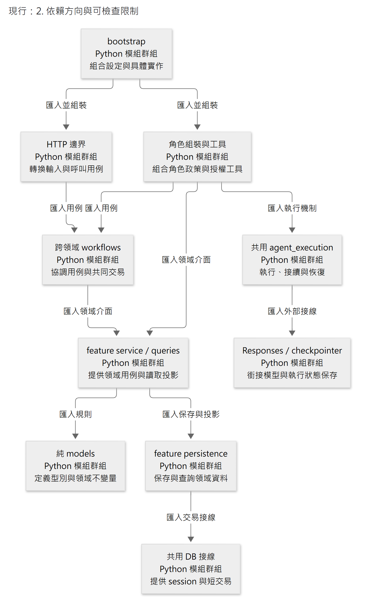

# 程式組織、依賴方向與命名

- 狀態：**現行程式組織與維護規範** 。目錄樹說明責任與依賴；實際路徑以程式及同題接線文件為準。
- 依據：[系統責任](../architecture/system-boundaries.md)、[工程取捨](../architecture/design-decisions.md)、[貢獻指南](../../CONTRIBUTING.md#驗證與提交)。採模組化單體，不將每個業務模組拆成部署或套件。
- 配套：[程式撰寫規範](coding-standard.md)定義函式／實例／Service、型別、錯誤、非同步與測試寫法；本頁保留目錄、依賴及共用命名責任。

依問題跳讀：[目錄與資料責任](#1-目錄依業務責任組織機制集中在少數邊界)、[允許依賴及替換點](#2-依賴方向與可檢查限制)、[命名](#3-名稱要能表達身分時間與效果)。具體函式及 React 寫法直接讀[撰寫規範](coding-standard.md)，無須先通讀整棵目錄樹。

## 1. 目錄依業務責任組織，機制集中在少數邊界

```text
apps/
  api/
    pyproject.toml / uv.lock
    contracts/                  # JSON Schema 唯一來源，依 http、tools 分用途
    src/caliburn/
      migrations/               # 隨套件交付的唯一 Alembic 歷史；不手改框架 checkpoint 表
      bootstrap.py              # 唯一組裝根：settings、DB、clients、services、graphs
      app_composition.py        # 明示不可變組裝選項；SDK／checkpointer factory 的生命週期由 bootstrap 管理
      settings.py               # 啟動配置驗證；不在 import 時讀密鑰或啟動程序
      features/
        job_files/              # 檔案名稱、受訪者、隔離與建立
        interviews/             # 原輸入、正式序號、原文範圍與來源資格
        job_description/        # JD、候選、來源、差異、正式稿與撤回
        work_memory/            # 情境／理解候選、固定來源關係、交接差異、發布快照
        interview_plans/        # 剩餘訪談／分析／JD 編修安排；不取代 Memory 或 Changes
        executions/             # 持久執行資格、取消／完成勝負與費用限制
      workflows/
        consultant_turn.py      # 跨模組 A 接受、完成、取消的協調
        memory_batch.py         # 背景領取、階段交接、發布協調
      agents/
        job_consultant/         # A：prompt、允許工具與起始投影
        work_situation_analyst/ # B1：只處理情境
        work_understanding_analyst/ # B2：依情境分析理解，不回交 B1
        memory_analysis/        # B1／B2 共用組裝（runner、起始 context、角色分派）；不是第三個角色
      agent_execution/          # 共用 node loop、原生 context、Step／恢復／compact
      diagnostics/              # 按需讀原生 checkpoint、重建本機診斷副本；不接產品執行路徑
      adapters/
        database.py             # engine／session／短交易機制
        database_settings.py    # 資料庫位置與 namespace 配置；由 adapter 擁有，settings 只負責組合
        openai_responses.py     # direct SDK；不另造 provider interface family
        openai_models.py        # 已核對的模型容量／推理等級與費率；無自動選型／fallback
        graph_checkpointer.py  # 官方 saver 初始化、序列化與身分綁定
        job_file_checkpointer.py # 檔案列鎖與官方 checkpoint 寫入共用交易，防止刪後遲到保存
        pdf_renderer.py         # 正式 JD 的受控列印
      transport/http/           # routers、DTO mapping、公開串流；無業務 SQL
      transport/model_tools/    # 模型工具的薄入口（JD／Memory 讀寫、背景整理、壓縮請求）；與 http 同為邊界
      contracts/generated/     # 生成 Python DTO，只有邊界可用
    tests/
      unit/ contracts/ integration/ journeys/ fixtures/
    evaluations/                # 固定案例與候選入口，沿正式 App／HTTP 執行及保存診斷
  web/
    package.json
    src/
      app/                      # 路由、啟動、providers、theme、工作畫面組裝（WorkspaceLayout、各 Pane）
      features/
        job-files/ interview/ jd-editor/ source-viewer/
      shared/api/               # generated 型別、HTTP／串流 transport
      shared/ui/                # 多處使用：icons、IconAction、SafeMarkdown／ChatMarkdown（共用 inert-markdown 規則）、對話捲動 hook；非業務元件大倉庫
    tests/e2e/
```

不先建立所有空資料夾／檔案。每個 feature 先以 `models.py`（純型別與不變量）、`service.py`（用例）、`persistence.py`（該領域 SQL）、`queries.py`（讀取投影）按實際需要建立；大了再依業務責任拆，例如 `citations.py`、`snapshots.py`。不是每功能必須四個檔案，也不為一個函式包 class。測試依受測責任命名，不做一份幾千行全產品測試。

業務表的 SQL 留在各 feature 的 persistence，不塞進全域 database.py；交易與連線機制才共用。`executions` 只擁有正式准入／控制資格與預算，不能再存一份 Graph node 游標、候選全文或模型對話。

Alembic 的 CLI 配置與啟動版本檢查均以 `caliburn:migrations` 定位同一套件資源；不可由 `__file__` 向上猜 checkout 或另複製一份 migration。安裝成 wheel 後也必須能取得完整歷史。啟動仍只檢查版本，升級需明確執行；見交付驗證。

`diagnostics` 是本機管理用的獨立讀取投影，不是新 feature authority。由明示 CLI 或評測入口使用；既有 Agent、workflow 與 HTTP 不依賴它。模組分為原生格式讀取（`checkpoints.py`）、純投影／遮蔽（`projection.py`）、診斷表定義（`persistence.py`）、一次性更新交易（`refresh.py`）及唯讀查閱（`inspection.py`）。跨表 JOIN 放在 Alembic 版本化的唯讀 VIEW，不把各領域的寫入 SQL 搬出原 feature。副本只供排查，不用來恢復工作、判斷提交或提供模型 context；操作見 [runbook](../operations/README.md#在-datagrip-查某個職務檔案的-ai-執行紀錄)。

## 2. 依賴方向與可檢查限制

圖為**現行後端的 Python 模組依賴視角**，採 [C4 notation](https://c4model.com/diagrams/notation)的元素種類、責任、技術及單向關係標示原則。矩形均為 Python 模組群組，實線箭頭由匯入方指向被匯入方，標籤說明允許匯入的用途。這些責任群組跨越多個程式檔，不是 C4 Component 層級或 UML Package 圖；箭頭也不表示呼叫先後。組裝根可注入所有具體實作，圖只列主要依賴，完整限制見下方規則及自動檢查。本圖表示法與來源已在本段交代，通用讀圖見[圖庫](../diagrams/README.md#讀圖約定)。

模組依**共同變更理由與資料責任**聚合：同一不變量、權限判斷及其修改集中在負責模組；可獨立變動的政策與外部 I/O 保留清楚邊界。高內聚、低耦合以「改一項行為需要理解及同步修改多少責任」檢查，不以檔案數、class 數或層數評分。

<!-- diagram: python-dependencies -->



[圖源](../diagrams/standards/code-organization/python-dependencies.mmd) · [SVG](../diagrams/standards/code-organization/python-dependencies.svg)

1. 領域純型別模組（`models.py` 及按責任拆分的 `*_models.py`）不 import FastAPI、SQLAlchemy、LangGraph、OpenAI 或別的 feature persistence。整個 `features`／`workflows` 不依賴 `contracts` 的 wire DTO、validator 或 package；傳輸驗證由 HTTP／Tool adapter 擁有，轉成內部型別後才進入領域及用例。此規則沿[契約策略](contract-strategy.md)，不只限制生成檔的直接 import。
2. Router／模型工具是薄入口，轉型後呼叫同一業務 service；人工與 AI 不各寫一套 JD validator。UI 不自行裁決權限、正式成功、來源版本或 Memory 發布。
3. `agent_execution` 不 import A／B1／B2 角色、JD 或 Memory ORM；由角色提供具名工具 handler 與起始資料。角色可依賴它，不能互相 import 私有 prompt／state。
4. 跨 feature 協調放 workflows；讀別的領域走具體公開查詢／typed result，不直查別人的私有表。需要跨域資格與排序一次完成的唯讀查詢，可由各 owner 公開具名 selectable，再由具名 workflow projection 組合；例如最新合法 Plan。查詢不取得寫入權、不新增結果權威，也不為一般呼叫建立通用查詢框架。共享交易由 workflow 開啟，把同一 session 交給指定 service；內層不私自 commit。不是微服務，也不需要把同庫內呼叫變 HTTP。
5. 真正需要替換外部 I/O 或行為元件時用窄 `Protocol`／callable；純 Python 少數消費者直接使用明確型別。替換點由消費者需要的責任決定，不替每個 class 配 interface，也不為此建立每類一套抽象 factory、BaseRepository 或萬用 UnitOfWork 註冊表。
6. 前端 `shared` 不 import feature；feature 不 import 別的 feature 私有元件。頁面跨 feature 協作由 app 組裝，server state 用同一 query cache，局部輸入草稿留局部元件。跨 feature 需要的畫面狀態不用 Effect 複製到上層 state：Turn 提示來自外部儲存（`useSyncExternalStore`），缺少提示時由 composer 查 current；頁面的唯讀 query 觀察者只訂閱同一份 cache，未知不可當閒置，不另發 GET／輪詢。feature 要在另一 feature 的項目旁放內容時，由 app 提供 render 函式（context），feature 不互相 import。詳見[介面 §1.6](../implementation/interface-and-delivery.md#16-工作畫面組裝)。

7. 層只向下 import：`adapters` ← `features` ← `workflows` ← `transport`／`agents` ← `bootstrap`；`agent_execution` 位於 `adapters` 之上，不 import `features`、`workflows`、`transport`、`agents`。`settings` 組合各 adapter 擁有的配置，adapter 不 import `settings`。B1／B2 的共用組裝 `agents/memory_analysis` 可被兩個角色使用，兩個角色之間不互相 import。這些由 `apps/api/.importlinter` 的具名契約檢查實際匯入圖；`pnpm architecture:check` 同時接入 `lint` 與 CI。純值與變換檢查間接 I/O 依賴，transport 的 SQL 限制只禁止直接 import，允許經 workflow／feature 呼叫。
8. `diagnostics` 是正式資料的觀察者，可讀公開型別及查詢；產品執行層不反向依賴診斷投影。架構 gate 同時以合法與非法 import 測例確認規則，仍不代表動態呼叫或所有責任切分已獲證明。

Prompt、Tool 與元件的持續對照沿上述邊界組裝：

- 角色提供提示、工具與 Context 政策；組裝根提供元件及外部依賴。實際需要比較的變點須能明確替換，其他正式執行、權限、交易及取消流程共用。
- 純 Prompt 比較只替換目標提示；Tool 可只改說明、schema、handler 或回傳，但四者須相容並明列必要連帶變動。整組能力消融另標比較範圍，不假稱單一變因。
- 配置在組裝處決定，不複製整個 Agent、不靠全域可變設定切組，也不把試驗旗標散入領域規則。具名參數、插件、MCP adapter 或現成評測工具皆依實際替換、測試及維護成本選用；共同業務規則留在負責模組，不隨 transport 或工具平台複製。
- 已保存的模型請求（captured request）與既有工作沿[執行接線](../implementation/agent-execution.md)的原請求／工具及恢復契約；更新配置不能重建或改寫原請求。本節不另訂持久版本格式。

現行顧問的 `ConsultantConfiguration` 保存提示區段、工具說明及 JD 讀取容量；`AppComposition` 在正式 `create_app` 注入配置、SDK client 與 checkpointer factory。比較入口先固定整批候選，再由相同值產生 manifest 與 runtime；不在 await 後重讀可變輸入。已捕捉的請求與工具容量沿原工作恢復，配置改變只影響尚未捕捉的新工作。新增實際變因時，在其負責模組擴充窄介面及反例，不把所有工具行為收進全域 registry。使用方式見 [evaluations](../../apps/api/evaluations/README.md)。

以上是維護及審查判準，不表示所有可想像的變因已有設定開關。介面／I/O／觀測寫法由[撰寫規範](coding-standard.md)維護，對照設計及驗收由[貢獻指南](../../CONTRIBUTING.md#模型品質比較)維護。

後端使用 Import Linter／Grimp，前端使用 ESLint import 限制。後端 `test_import_boundaries.py` 用真實臨時 Python package 驗證 relative import、re-export、`TYPE_CHECKING`、拆分 persistence、間接 ORM 及合法 workflow；另核對 graph 包含全部產品模組，新增 `*_models`／`*_changes`／`*_persistence` 須有對應政策。拆分 persistence 由原 feature、跨域 workflow、離線 diagnostics 及 migration 使用，其他 feature 不能直接匯入。一般 package 明確提供 `__init__.py`，避免工具漏掃巢狀 namespace。需要例外先說出實際循環／成本，不能用 `TYPE_CHECKING` 或動態 import 掩蓋不當依賴；静態圖不保證動態匯入或業務責任已正確。驗證見程式組織審查。

本案借鑑 [AWS ports／adapters](https://docs.aws.amazon.com/prescriptive-guidance/latest/hexagonal-architectures/overview.html)的業務與 I/O 分離；不聲稱上述目錄是 AWS 標準模板，也不照搬每層必須 interface 的儀式。

## 3. 名稱要能表達身分、時間與效果

| 類型 | 本案規則／例子 |
|---|---|
| Python module／函式／變數 | `snake_case`；`publish_memory_snapshot`、`complete_consultant_turn`、`list_work_situations`，不用 `process_data`／`handle_thing` |
| Python class／型別 | `PascalCase`；`MemorySnapshot`、`ConsultantTurnBinding`、`CandidatePosition`；不把所有服務叫 Manager／Engine |
| TypeScript | 型別／React 元件 `PascalCase`，函式／變數 `camelCase`，hook `use…`；元件檔 `JdEditor.tsx`、一般檔 `jd-api.ts`，資料夾 kebab-case |
| wire／schema／模型工具 | 沿契約的 snake_case，不為 JS 美觀換一套欄名；工具動賓短語。native provider keys 不重命名 |
| 身分與位置 | `job_file_id`、`memory_snapshot_id`、`object_id`、`revision_id`、`interview_sequence`；不能全叫 `version`／`id` |
| 時間／容量 | `timeout_seconds`、`input_tokens`、`cost_usd`；布林 `is_…`／`has_…`，不讓數字單位靠記憶 |
| 角色與資料 | 程式用完整角色名；A／B1／B2 僅作文件別名。內部 `work_situation`／`work_understanding`，不沿用含義模糊的 case／memory_data |
| 命令與查詢 | 查詢 `read/get/list/compare` 無業務寫入副作用；命令 `create/revise/delete/publish/confirm` 描述效果。`complete` 只能表示已成立的相應完成邊界 |
| 測試 | `test_cancelled_turn_cannot_publish_late_tool_result`；清楚行為與條件，不以 `test_01` 或實作函式名取代意圖 |

`target_title` 是 Memory 模型選擇；`read_ref` 是 JD 模型定位；`citation_ref` 是既存 JD 依據定位；三者不互換。`turn` 是執行工作，`step` 是一次模型回應及工具結果，`interview_sequence` 是正式訪談順序。不能把圖的 super-step 當產品 Step。

命名原則參考 [Google Python](https://google.github.io/styleguide/pyguide.html#316-naming)、[Google TypeScript](https://google.github.io/styleguide/tsguide.html#identifiers)。本案選擇 TS 檔名與格式化器，不表示原樣採用 Google 全部內部規約。

## 4. 讓修改容易理解

- 每個 module 以短 docstring 說明責任與邊界，讓讀者不必逐行推測模組用途。
- 模組超大先找職責混合及共同變更理由，不用固定行數硬拆；若一次規則變更仍須同步修改多個模組，應重查責任及公開介面。通用 helper 只有真正相同語意與多個使用者才提取，相似形狀不代表相同業務。
- 程式規則由 Ruff／mypy／TS／ESLint 驗；業務規則由測試驗。每次變更一起維護相應責任文件，不把所有說明塞進 AGENTS.md。

介面與型別、錯誤、註解及 Log 的具體寫法集中在[撰寫規範](coding-standard.md)，本頁只維護模組責任與依賴。
