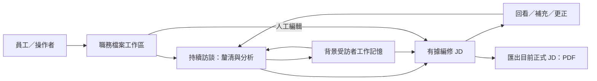

# Caliburn 全產品目標架構導覽

- 狀態：**現行產品架構導覽，含已採用設計與待對齊事項**；更新：2026-10-02。正式後端為 [`apps/api`](../apps/api/README.md)，介面為 [`apps/web`](../apps/web/README.md)；[ADR0079](adr/0079-target-rebuild-production-cutover.md) 已於 2026-10-02 Accepted，取代 ADR0077 的正式產品權責。
- 驗證範圍：[任務表](plans/2026-09-29-target-rebuild/tasks.md)的 T01–T18 已標記完成，不等於所有情境均通過驗收。逐項結果依 [T17 V01–V28 對照](plans/2026-09-29-target-rebuild/evidence/t17-v01-v28-closure.md)，品質與實測限制見[實驗發現的問題](reports/experiment-findings.md)。
- 目的：從產品目的逐層定位職責、資料、流程、介面與驗證證據。維護角色：App 架構維護者。
- 閱讀分工：本頁描述能力與責任；實際程式結構見 [ARCHITECTURE](../ARCHITECTURE.md)及[實作文件](implementation/README.md)。[架構討論規範](architecture-discussion-standard.md)提供討論方法，仍為討論稿，不取代正式決策。

**設計與現行差異：**Memory 已確定採單向 B1 → B2 → 發布；現行 supervisor 接入的工作流程及 B2 提示仍啟用回交 B1，程式尚未對齊，並非設計仍待選擇。詳細責任與程式依據見[系統責任](architecture/system-boundaries.md)。舊 `experiments/jd-relational-app` 與 `packages/consultant-memory` 程式已退役，沿革與 Git 歷史保留；不整合舊接線、不遷移舊資料。RAG 為獨立範圍。

2026-09-29 的[文件與圖面審查](architecture/verification.md#6-架構文件補完與圖面審查2026-09-29-續審)是設計沿革；現行實作與驗證範圍以 2026-10-02 的正式切換及任務證據判定。

## 一眼看懂：產品邊界與主要能力

初次認識產品可先讀[產品專題介紹](product-introduction.md)；本頁提供全產品架構的閱讀入口。下圖是**產品能力關係視圖**，不表示每項品質目標均已驗證，也不是執行順序或服務部署；箭頭表示功能關係，精確生效條件往生命週期深入。



圖是**產品能力關係**，不是每輪固定執行順序。核心價值是「員工只需說明工作，顧問逐步產出涵蓋主要工作、精簡而高訊號的 JD」；Memory、Agent 與工具是支援手段。未知／衝突須釐清，不靠模型自行補事實。專用全稿審核近期暫緩，PDF 不表示已通過全稿審核。

## 從整體進到各責任

按問題閱讀，不必每次重讀全部。下表的責任文件持續更新；日期檔名不是歷史失效標記。

| 視角／要回答的問題 | 唯一詳細入口 |
|---|---|
| 為誰、完成什麼、哪些不做；用語與產品約束 | [產品概念](product-concept.md)；品質依[工作分析／JD 研究入口](guides/2026-09-09-job-analysis-and-jd-content-research.md) |
| App 有哪些責任，Agent／業務／DB 如何互動 | [系統責任與資料流](architecture/system-boundaries.md) |
| 使用者一輪到背景發布，正常及異常怎麼走 | [核心閉環與跨層生命週期](specs/2026-09-29-core-value-loop-lifecycle.md) |
| A 的上下文、固定 Memory、工具及按需閱讀 | [顧問 context 與 State](specs/2026-09-26-consultant-context-and-state-design.md) |
| Memory 三層、物件／快照、B1／B2 分工 | [Memory 子圖](specs/2026-09-24-caliburn-layered-architecture-map.md) → [背景生命週期](specs/2026-09-25-b1-b2-information-gap-lifecycle.md) |
| 共用模型／工具迴圈、Step 恢復、暫停／取消、壓縮 | [LangGraph／Responses 共用執行](specs/2026-09-27-shared-agent-execution-and-state-design.md) |
| 模型工具怎麼命名、分權、輸入及回傳 | [工具共同規範](specs/2026-09-27-agent-tool-contract-design-research.md) |
| Memory map/read／訪談序號、CRUD／V4A | [讀取與來源](specs/2026-09-27-memory-read-and-source-navigation-contract.md)、[更新契約](specs/2026-09-27-memory-object-update-tool-contract.md)、[完整範例](specs/2026-09-28-memory-tools-crud-examples.md) |
| JD 的欄位、按需讀寫、依據、人工與來源 diff | [JD 工具與領域契約](specs/2026-09-29-jd-model-tool-contract-review.md)；欄位意義依[寫作指南](guides/2026-09-09-jd-field-and-writing-guide.md) |
| 保存／版本／交易、候選與 checkpoint、原結果核對 | [資料責任與交易](architecture/persistence.md) |
| UI 效果、程序、啟停、安全、外送、PDF | [互動與運作](architecture/delivery-and-operations.md) |
| 為何選這些工程方向，何時值得更換 | [設計取捨](architecture/design-decisions.md) |
| 如何證明做對、哪些只是文件已定、還差什麼 | [覆蓋與驗收矩陣](architecture/verification.md) |

### 文件實際如何分層

```text
docs/
  product-introduction.md             ← 產品目的、旅程與設計解說
  target-architecture-map.md          ← 全產品入口，只管路由與狀態
  product-concept.md                 ← 已確認產品效果、概念與用語
  architecture-discussion-standard.md← 如何研究、討論、維護
  architecture/
    system-boundaries.md             ← 全系統責任、資料流
    persistence.md                   ← 共用保存、版本及交易
    delivery-and-operations.md        ← 使用介面、部署及安全
    design-decisions.md               ← 工程選擇與比較
    verification.md                   ← 覆蓋、反例、驗收與缺口
  specs/                             ← 上表列名的元件／介面責任文件
  adr/                               ← 正式架構決策，不改寫歷史
  current-decisions.md                ← 最新狀態及演進路由，不複製正文
```

現有專題文件不為搬目錄而複製；上表是**架構責任文件集合**。其餘 specs、plans、evidence 按 register 判定為現行、研究或歷史，不因同名／日期較新就覆蓋本集合。後續僅在出現新的獨立責任時分檔，不每次討論新增一份「最新版」。

### 架構圖閱讀順序

各圖依所在文件區分現行機制、採用設計與待對齊事項；舊專題若仍標示未實作，須併讀其最新狀態與任務證據。Mermaid 原始碼與正文在同一責任文件維護；不能只改圖、不改契約，或把箭頭推導成另一套權限。先看問題，再選圖，不必一口氣讀完全部細節。

| 想知道什麼 | 視圖及唯一位置 |
|---|---|
| 產品為誰解決什麼，使用者怎麼走 | [產品旅程](product-introduction.md#3-使用者會怎麼走過這個流程) |
| App 裡各模組如何分責與交接 | [系統邏輯模組圖及介面契約](architecture/system-boundaries.md#2-app-拆開後有哪些責任) |
| 何時形成正式訪談、JD 與背景要求 | [正常閉環與並行時序](specs/2026-09-29-core-value-loop-lifecycle.md) |
| 一輪的 context 如何組裝，模型／工具如何接續 | [A 正常時序](specs/2026-09-26-consultant-context-and-state-design.md#4-資料流與正常生命週期) |
| 暫停、取消、中斷與完成怎麼區分 | [共用執行與控制狀態圖](specs/2026-09-27-shared-agent-execution-and-state-design.md#控制與故障的狀態視圖) |
| Memory 三層、不可變修訂與快照如何關聯 | [Memory 資料流與快照圖](specs/2026-09-24-caliburn-layered-architecture-map.md) |
| B1／B2 如何分工、交接、恢復及發布 | [三個安全點與背景流程](specs/2026-09-25-b1-b2-information-gap-lifecycle.md#候選操作快照與三個安全點目標已確認未實作) |
| 本機與外部供應商界線在哪裡 | [部署／外送圖](architecture/delivery-and-operations.md#2-最小部署視角) |

圖面可渲染不等於設計正確；依[驗收矩陣](architecture/verification.md)檢查箭頭條件、資料責任元件、取消／恢復及發布反例。歷史圖留在各自歷史文件，不作新架構的備選路徑。

## 必須跨責任追蹤的關係

- **來源鏈與按需分析**：原始訪談 → 工作情境 → 工作理解；JD 可直接採用合格原話／情境／理解。map 定位、diff 找上游變更、目前可見正文補完整脈絡，三者不互相代替。
- **兩種一致性**：A 固定一版正式 Memory；B1／B2 改最新候選，完成才發布不可變快照。候選綁定隨物件修改，JD 歷史依據不自動換版，只有 JD 需要明確核對對齊。
- **兩種歷史**：原生模型接續用來繼續推論；正式訪談用來保存與引用真實交流。取消輸入及公開中間文字不能因保存過就成為正式訪談。
- **兩種回復**：Step 接續保留同一 Turn 基準；取消／放棄整輪回到新輸入前，保留已採用輪前 compaction；含被放棄輸入的輪中壓縮不得跨回退承接。完成、取消及結果不明均按正式操作結果判斷。
- **兩種 diff**：上游來源換版與人修改 JD 各有基準，不能互相消除待核對；看過 diff 不等於確認支持。Memory 候選不增加逐邊核對工作流。

<a id="業務規則與交易機制owner-已確認目標未實作未驗收"></a>

### 業務規則與交易機制

業務決定什麼必須一起成立，App 協調用例，PostgreSQL 接線提供交易安全、原子性、約束及持久結果。Graph 保存執行位置，不充當正式業務結果，也不新增第二套 validator／receipt。詳細責任及工程方向只在[資料與交易](architecture/persistence.md)維護；不跨模型等待開長交易。

## 現行、目標與未決不可混畫

- **現行機制**：`apps/api`／`apps/web` 已為正式產品，採模組化單體、PostgreSQL 業務保存、LangGraph checkpoint 與 OpenAI direct Responses。T01–T18 完成狀態不替代各項效果的實測判定。
- **已採用設計**：來源資格、候選、固定快照、取消及按需工具等產品契約由各責任文件定義。單向 B1 → B2 → 發布與現行回交分支仍有差異，不能宣稱全部對齊。
- **驗證限制與未決**：依 V01–V28 保留部分通過、離線／資料庫證據與未驗之別；真人時間與學習負擔尚未驗證。Memory 最終失敗後再前進三輪的解阻政策仍待產品決策確認。詳細限制見[覆蓋與驗收](architecture/verification.md)。
- **明確後延**：全稿審核、原話語意搜尋及跨機還原。**不採用** C 即時修補、無具體需求的通用規則引擎及舊資料遷移；C 不是等待恢復的功能。
- **歷史**：ADR0077 及舊架構僅供沿革查考，不作現行執行路徑。

驗證層級見[驗收矩陣](architecture/verification.md#3-施工前與實作後的門檻)。設計變更須有可證偽的效果與相應證據；涉及產品語意、資料承諾或外送範圍的改變，依[決策流程](decision-process.md)記錄取捨。
