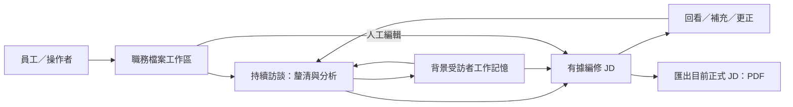

# Caliburn 全產品目標架構導覽

- 狀態：**目標設計／未實作、未驗收**；產品已確認效果與工程建議分列，不授權施工或 production 切換。維護者：App 架構維護者；更新：2026-09-29。
- 目的：讓新開發者／Agent 從產品出發，逐層找到職責、資料、流程、介面及驗收，不必遍讀討論歷史或由舊程式猜新規則。
- 方法：[架構討論規範](architecture-discussion-standard.md)。現行產品另讀 [ARCHITECTURE](../ARCHITECTURE.md) 與 [ADR0077](adr/0077-relational-jd-app-production-authority-and-pnpm-entrypoint.md)；**現行是底稿，目標不要求舊架構／資料整合**。

**2026-09-29 文件補完基線：**下列責任集合已補到產品效果、跨層契約與正常／異常流程可追讀，架構圖已渲染核對。實際範圍及剩餘工程驗證見[續審紀錄](architecture/verification.md#6-架構文件補完與圖面審查2026-09-29-續審)；後續才規劃實作，不將本頁當施工授權。

**後續施工狀態：**Owner 已另以 Goal 授權[SDD／TDD 實作計畫](plans/2026-09-29-target-rebuild/README.md)，工程代理沿[程式設計文件](implementation/README.md)推進；實際完成與驗證只查[任務表](plans/2026-09-29-target-rebuild/tasks.md)。上方「後續才規劃」是文件補完當時狀態。本頁各圖仍描述目標契約，不能因施工開始就視為能力已完成或 production 已切換。

## 一眼看懂：產品邊界與主要能力

初次認識產品可先讀[產品專題介紹](product-introduction.md)；本頁則是開發者與 Agent 的唯一目標設計入口。下圖是**目標能力關係／未實作**，不是執行順序或服務部署；箭頭表示功能關係，精確生效條件往生命週期深入。



圖是**目標能力關係**，不是每輪固定執行順序。核心價值是「員工只需說明工作，顧問逐步產出涵蓋主要工作、精簡而高訊號的 JD」；Memory、Agent 與工具是支援手段。未知／衝突須釐清，不靠模型自行補事實。專用全稿審核近期暫緩，PDF 不表示已通過全稿審核。

## 從整體進到各責任

按問題閱讀，不必每次重讀全部。下表的責任文件持續更新；日期檔名不是歷史失效標記。

| 視角／要回答的問題 | 唯一詳細入口 |
|---|---|
| 為誰、完成什麼、哪些不做；用語與產品約束 | [產品概念](product-concept.md)；品質依[工作分析／JD 研究入口](specs/2026-09-09-job-analysis-and-jd-content-research.md) |
| App 有哪些責任，Agent／業務／DB 如何互動 | [系統責任與資料流](architecture/system-boundaries.md) |
| 使用者一輪到背景發布，正常及異常怎麼走 | [核心閉環與跨層生命週期](specs/2026-09-29-core-value-loop-lifecycle.md) |
| A 的上下文、固定 Memory、工具及按需閱讀 | [顧問 context 與 State](specs/2026-09-26-consultant-context-and-state-design.md) |
| Memory 三層、物件／快照、B1／B2 分工 | [Memory 子圖](specs/2026-09-24-caliburn-layered-architecture-map.md) → [背景生命週期](specs/2026-09-25-b1-b2-information-gap-lifecycle.md) |
| 共用模型／工具迴圈、Step 恢復、暫停／取消、壓縮 | [LangGraph／Responses 共用執行](specs/2026-09-27-shared-agent-execution-and-state-design.md) |
| 模型工具怎麼命名、分權、輸入及回傳 | [工具共同規範](specs/2026-09-27-agent-tool-contract-design-research.md) |
| Memory map/read／訪談序號、CRUD／V4A | [讀取與來源](specs/2026-09-27-memory-read-and-source-navigation-contract.md)、[更新契約](specs/2026-09-27-memory-object-update-tool-contract.md)、[完整範例](specs/2026-09-28-memory-tools-crud-examples.md) |
| JD 的欄位、按需讀寫、依據、人工與來源 diff | [JD 工具與領域契約](specs/2026-09-29-jd-model-tool-contract-review.md)；欄位意義依[寫作指南](specs/2026-09-09-jd-field-and-writing-guide.md) |
| 保存／版本／交易、候選與 checkpoint、原結果核對 | [資料責任與交易](architecture/persistence.md) |
| UI 效果、程序、啟停、安全、外送、PDF | [互動與運作](architecture/delivery-and-operations.md) |
| 為何選這些工程方向，何時值得更換 | [設計取捨](architecture/design-decisions.md) |
| 如何證明做對、哪些只是文件已定、還差什麼 | [覆蓋與驗收矩陣](architecture/verification.md) |

### 文件實際如何分層

```text
docs/
  product-introduction.md             ← 給人看的產品介紹；由責任文件解說而來
  target-architecture-map.md          ← 全產品入口，只管路由與狀態
  product-concept.md                 ← 已確認產品效果、概念與用語
  architecture-discussion-standard.md← 如何研究、討論、維護
  architecture/
    system-boundaries.md             ← 全系統責任、資料流
    persistence.md                   ← 共用保存、版本及交易
    delivery-and-operations.md        ← 使用介面、部署及安全
    design-decisions.md               ← 工程選擇與比較
    verification.md                   ← 覆蓋、反例、驗收與缺口
  specs/                             ← 上表列名的元件／介面責任文件
  adr/                               ← 正式架構決策，不改寫歷史
  current-decisions.md                ← 最新狀態及演進路由，不複製正文
```

現有專題文件不為搬目錄而複製；上表是**有效目標集合**。其餘 specs、plans、evidence 按 register 判定為現行、研究或歷史，不因同名／日期較新就覆蓋本集合。後續僅在出現新的獨立責任時分檔，不每次討論新增一份「最新版」。

### 架構圖閱讀順序

各圖均是目標／未實作視圖，Mermaid 原始碼與正文在同一責任文件維護；不能只改圖、不改契約，或把箭頭推導成另一套權限。先看問題，再選圖，不必一口氣讀完全部細節。

| 想知道什麼 | 視圖及唯一位置 |
|---|---|
| 產品為誰解決什麼，使用者怎麼走 | [產品旅程](product-introduction.md#3-使用者會怎麼走過這個流程) |
| App 裡各模組如何分責與交接 | [系統邏輯模組圖及介面契約](architecture/system-boundaries.md#2-app-拆開後有哪些責任) |
| 何時形成正式訪談、JD 與背景要求 | [正常閉環與並行時序](specs/2026-09-29-core-value-loop-lifecycle.md) |
| 一輪的 context 如何組裝，模型／工具如何接續 | [A 正常時序](specs/2026-09-26-consultant-context-and-state-design.md#4-資料流與正常生命週期) |
| 暫停、取消、中斷與完成怎麼區分 | [共用執行與控制狀態圖](specs/2026-09-27-shared-agent-execution-and-state-design.md#控制與故障的狀態視圖) |
| Memory 三層、不可變修訂與快照如何關聯 | [Memory 資料流與快照圖](specs/2026-09-24-caliburn-layered-architecture-map.md) |
| B1／B2 如何分工、交接、恢復及發布 | [三個安全點與背景流程](specs/2026-09-25-b1-b2-information-gap-lifecycle.md#候選操作快照與三個安全點目標已確認未實作) |
| 本機與外部供應商界線在哪裡 | [部署／外送圖](architecture/delivery-and-operations.md#2-最小部署視角) |

圖面可渲染不等於設計正確；依[驗收矩陣](architecture/verification.md)檢查箭頭條件、資料 owner、取消／恢復及發布反例。歷史圖留在各自歷史文件，不作新架構的備選路徑。

## 必須跨責任追蹤的關係

- **來源鏈與按需分析**：原始訪談 → 工作情境 → 工作理解；JD 可直接採用合格原話／情境／理解。map 定位、diff 找上游變更、目前可見正文補完整脈絡，三者不互相代替。
- **兩種一致性**：A 固定一版正式 Memory；B1／B2 改最新候選，完成才發布不可變快照。候選綁定隨物件修改，JD 歷史依據不自動換版，只有 JD 需要明確核對對齊。
- **兩種歷史**：原生模型接續用來繼續推論；正式訪談用來保存與引用真實交流。取消輸入及公開中間文字不能因保存過就成為正式訪談。
- **兩種回復**：Step 接續保留同一 Turn 基準；取消／放棄整輪回到新輸入前，保留已採用輪前 compaction；含被放棄輸入的輪中壓縮不得跨回退承接。完成、取消及結果不明均按正式操作結果判斷。
- **兩種 diff**：上游來源換版與人修改 JD 各有基準，不能互相消除待核對；看過 diff 不等於確認支持。Memory 候選不增加逐邊核對工作流。

### 業務規則與交易機制（Owner 已確認目標／未實作、未驗收）

業務決定什麼必須一起成立，App 協調用例，PostgreSQL 接線提供交易安全、原子性、約束及持久結果。Graph 保存執行位置，不充當正式業務結果，也不新增第二套 validator／receipt。詳細責任及工程方向只在[資料與交易](architecture/persistence.md)維護；不跨模型等待開長交易。

## 現行、目標與未決不可混畫

- **已確認產品目標**：產品概念及各責任文件明列的 Owner 決策；本次未重開三層、候選、快照、來源資格、取消及按需工具方向。
- **研究後工程建議**：模組化單體、業務候選保存／checkpoint 接續引用、短交易及可恢復調度；可在效果相同的前提下由工程代理驗證修訂，不冒充 production 已採用。
- **待工程驗證**：SDK／model 相容性、strict wire、diff／patch 實際效果、真 PostgreSQL 中斷競爭、UI 串流及長訪談品質。表／索引／函式不要求 Owner 再設計。
- **明確後延**：全稿審核、原話語意搜尋及跨機還原。**目標不採用**：C 即時修補、無具體需求的通用規則引擎及舊資料遷移；C 是目標退役，不是等待恢復的功能。不以這些未做判定首版文件缺漏。
- **現況與歷史**：仍以 current authority／程式／實測為證；目標文件完成不代表重構、實作或驗收完成。

後續從[驗收矩陣的施工順序](architecture/verification.md#3-施工前與實作後的門檻)開始。先定可證偽的切片再寫 code；有新證據改變產品效果時才回到 Owner，不為每個表名或 JSON 細節重新開始架構討論。
