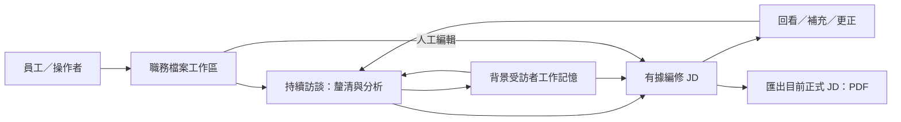

# Caliburn 架構導覽

Caliburn 透過持續訪談，把員工分散的工作資訊整理成有依據的職務說明書（JD）。系統由本機 Web 工作區、後端業務模組、AI 分析流程與資料庫組成；背景工作記憶支援長訪談，來源關係讓每項分析與 JD 改動可以回查。

本頁先說明整體運作，再提供各主題的閱讀入口。若想先了解需求與使用情境，可從[產品介紹](product-introduction.md)開始；完整的圖文解說見[系統架構報告](reports/system-architecture/README.md)。

## 一眼看懂：產品邊界與主要能力

員工說明工作，顧問追問不清楚的責任、條件與結果，資料足夠時逐步編修 JD。員工也能直接改稿，或繼續訪談補充、更正。這個流程不限定訪談輪數，也不要求每輪都修改 JD。

背景 Memory 依序把正式訪談整理成工作情境與工作理解，再發布為固定快照。顧問可以先引用有效原話，不必等背景整理完成。PDF 則匯出目前正式 JD，不包含正在處理的候選修改。

## 從整體進到各主題

| 想了解的問題 | 閱讀入口 |
|---|---|
| 產品為誰解決什麼問題，核心概念是什麼？ | [產品概念](product-concept.md) |
| 各模組如何協作，資料流向哪裡？ | [系統責任與資料流](architecture/system-boundaries.md) |
| 訪談、JD 修改與背景整理何時正式生效？ | [核心閉環與生命週期](specs/2026-09-29-core-value-loop-lifecycle.md) |
| 顧問如何組裝 Context、固定 Memory 與按需閱讀？ | [顧問 Context](specs/2026-09-26-consultant-context-and-state-design.md) |
| 原始訪談、工作情境與工作理解如何組織？ | [Memory 分層設計](specs/2026-09-24-caliburn-layered-architecture-map.md) |
| B1、B2 如何整理、交接與發布？ | [背景整理生命週期](specs/2026-09-25-b1-b2-information-gap-lifecycle.md) |
| 模型與工具如何接續，暫停或中斷後如何恢復？ | [共用執行機制](specs/2026-09-27-shared-agent-execution-and-state-design.md) |
| 工具如何命名、限制權限與回傳結果？ | [工具設計](specs/2026-09-27-agent-tool-contract-design-research.md) |
| Memory 如何定位、讀取、編輯與引用？ | [讀取與來源](specs/2026-09-27-memory-read-and-source-navigation-contract.md)、[物件更新](specs/2026-09-27-memory-object-update-tool-contract.md)、[操作範例](specs/2026-09-28-memory-tools-crud-examples.md) |
| JD 的欄位、來源與差異如何處理？ | [JD 資料與工具](specs/2026-09-29-jd-model-tool-contract-review.md)、[JD 寫作指南](guides/2026-09-09-jd-field-and-writing-guide.md) |
| 版本、交易與執行資料如何保存？ | [資料保存與交易](architecture/persistence.md) |
| 畫面、串流、PDF 與本機服務如何運作？ | [互動與運作](architecture/delivery-and-operations.md) |
| 為什麼採用這些技術與設計？ | [設計取捨](architecture/design-decisions.md) |
| 有哪些測試結果與已知限制？ | [驗證與限制](architecture/verification.md)、[實驗發現](reports/experiment-findings.md) |

### 架構圖閱讀順序

| 想看哪段流程 | 圖的位置 |
|---|---|
| 使用者從訪談到取得 JD | [產品旅程](product-introduction.md#3-使用者會怎麼走過這個流程) |
| Web、AI 執行、業務模組與資料庫 | [系統邏輯模組圖](architecture/system-boundaries.md#2-app-拆開後有哪些責任) |
| 正式訪談、JD 與背景要求的提交時序 | [正常閉環與並行時序](specs/2026-09-29-core-value-loop-lifecycle.md) |
| 一輪模型輸入與工具往返 | [顧問執行時序](specs/2026-09-26-consultant-context-and-state-design.md#4-資料流與正常生命週期) |
| 暫停、取消、中斷與完成 | [執行狀態圖](specs/2026-09-27-shared-agent-execution-and-state-design.md#控制與故障的狀態視圖) |
| 三層 Memory、物件修訂與快照 | [Memory 資料圖](specs/2026-09-24-caliburn-layered-architecture-map.md) |
| 背景整理的三個安全點 | [B1／B2 流程](specs/2026-09-25-b1-b2-information-gap-lifecycle.md#候選操作快照與三個安全點) |
| 本機服務與外部模型的界線 | [部署與外送圖](architecture/delivery-and-operations.md#2-最小部署視角) |

## 貫穿系統的五個設計概念

- **分層分析與按需閱讀。**原始訪談 → 工作情境 → 工作理解逐層整理；JD 可採用任一層的合格依據。導覽找位置，diff 找變化，正文與原話補足脈絡。
- **候選與正式快照。**B1／B2 修改目前候選，完成才發布不可變快照。A 每輪固定一版正式 Memory，背景新版不改變執行中的基準；JD 歷史依據也不自動換版。
- **執行歷史與正式訪談。**原生模型輸出與工具結果用於接續推論；正式訪談保存有效交流。取消輸入、中間訊息與推理摘要即使可回看，也不因此取得正式來源資格。
- **Step 接續與整輪取消。**Step 恢復保留同一輪的資料基準；取消則退回新輸入前，保留已採用的輪前 compaction。含有被放棄輸入的輪中壓縮不能跨回退使用。
- **來源差異與人工改稿。**來源換版與人工修改 JD 有各自的比較基準。看過 diff 不代表已確認依據；只有 JD 需要明確核對對齊，Memory 候選沒有逐筆確認引用的流程。

### 業務規則與交易機制

業務模組決定哪些結果必須一起成立，工作流程協調操作，PostgreSQL 負責原子提交、約束與持久保存。顧問完成時，正式訪談、JD 候選採用與執行完成狀態在同一交易提交；Memory 發布時則固定快照與處理進度。LangGraph 保存執行位置，恢復時仍以正式業務結果為準。交易內不等待模型回應，詳細機制見[資料與交易](architecture/persistence.md)。

## 目前範圍與已知限制

現行產品使用 React／MUI、FastAPI、PostgreSQL、LangGraph 與 OpenAI Responses API，採本機模組化單體。Memory 為單向 B1 → B2 → 發布，不回交 B1。獨立 RAG 研究目前不是 JD App 的執行依賴。

既有實驗包含真模型合成旅程、資料庫測試與離線測試；各自證明的範圍不同。真人訪談的省時與學習負擔尚待評估，部分背景壓縮與發布分支尚未驗證。Memory 最終失敗後再前進三輪才允許新批次，是現行程序的行為，產品政策仍待確認。結果與限制集中在[驗證章節](architecture/verification.md)。

專用全稿審核、原話語意搜尋與跨機還原尚未提供。不採用即時修補角色 C、固定雙向互審或通用規則引擎；舊架構資料不遷入現行產品。
